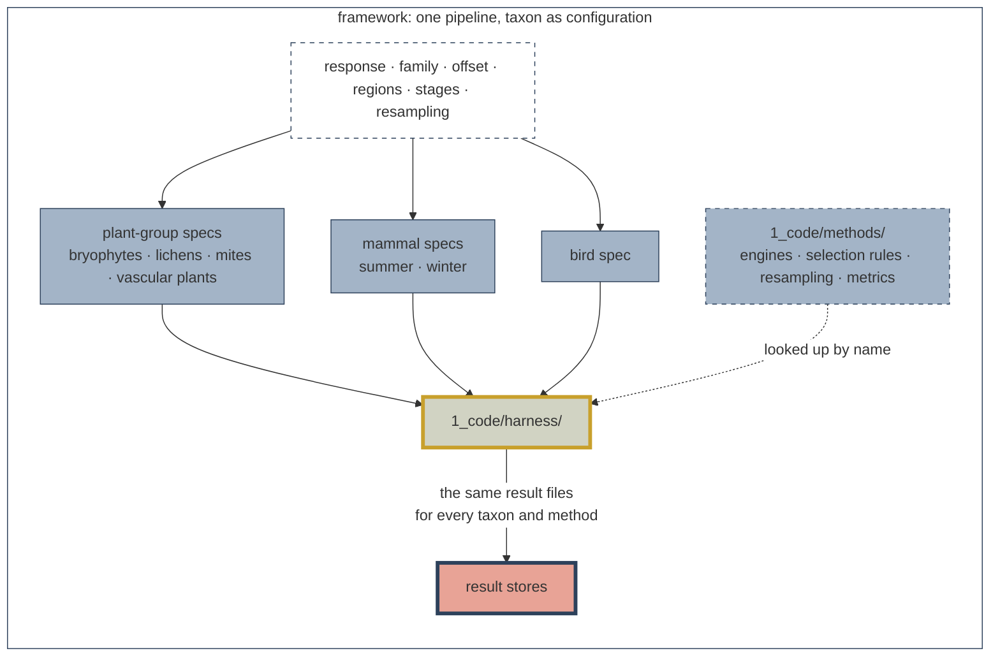
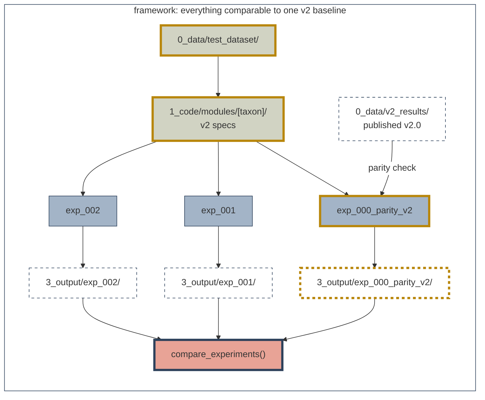

# SDMs Methods Development


> [!IMPORTANT]
> This repository is developed by and for the Science Centre at the Alberta Biodiversity Monitoring
Institute (ABMI). It is intended for internal use.
>

The ABMI Science Centre's shared R&D repository for Species Models 3.0.
It holds a frozen cross-taxa test dataset, one modelling pipeline that
runs every taxon's v2.0 model as configuration, and a v2 parity check
(`exp_000`) that every later experiment is compared against. A methods
question is asked once and answered for every taxon. It is for
Science Centre modellers testing methods; it does not produce the
final species models or reporting products.

## Status

| Component | State |
| --- | --- |
| Test dataset | Built for bryophytes, lichens, soil mites, vascular plants, mammals and birds. Validated by `_setup/02`. Published to ABMI-DATA2, version 2026-10-05 |
| v2 reference | ABMIexploreR's published coefficients, harmonized by `_setup/08` |
| Pipeline | Built: plug-in methods, parallel species, final-model metrics and habitat grids for every taxon, experiment runner, contract tests |
| Taxon specs | Every stage of every taxon runs. Each spec's `v2_coverage` states what it reproduces; `report.md` prints it |
| exp_000 (v2 parity) | A 100-draw run on the `parity_check` species passed all 22 taxon × region × stage rows on 2026-10-03 (see the [exp_000 README](1_code/experiments/exp_000_parity_v2/README.md)). The committed tables are from a later 5-draw trial. Not yet a gate: see [Parity gate](#parity-gate) |

## Repository structure

```
sdmMethodsDev/
├── 0_data/                 # gitignored except v2_scripts/ and *.R
│   ├── test_dataset/       # _setup/ output; runs read the published copy
│   ├── v2_results/         # the v2 parity reference, from _setup/08
│   ├── external/           # downloaded sources (ABMIexploreR), from _setup/08
│   ├── covariates/         # reserved; empty
│   └── v2_scripts/         # v2 scripts as received; reference only
├── 1_code/
│   ├── harness/            # the shared pipeline; names no taxon or method
│   ├── methods/            # engines, selection rules, resampling, metrics
│   ├── modules/            # one v2 spec per taxon; _shared/ for common code
│   ├── experiments/        # one folder per question; _template/, _shared/
│   ├── _setup/             # 00-10: build, check and publish the dataset
│   ├── tests/              # contract tests and the store comparison
│   └── _scratch.R          # dated workspace for exploration
├── 2_pipeline/             # result stores and intermediates; gitignored
├── 3_output/<exp_id>/      # per-experiment outputs; summaries committed
└── docs/                   # getting started, design, taxon quirks, reviews
```

What each folder is for, and what an edit there affects, is in
[`docs/getting_started.md`](docs/getting_started.md#where-things-are).

## How it works

The v2.0 pipelines share one sequence: pick survey units, fit candidate
models, choose among or average them, predict and score. Here each
taxon's contents of those steps are data, in a **spec**
(`1_code/modules/<taxon>/spec.R`). One **harness** runs any spec, and
looks up each **method** (engine, selection rule, resampling scheme,
metric) by the name the spec gives.



### Everything is compared with one v2 baseline



exp_000 runs every taxon's v2 spec and checks it against the published
v2.0 output. Every later experiment changes one thing and is compared
with exp_000, so a difference is a difference in method rather than in
plumbing. Because the dataset is frozen, results stay comparable.

The design, the spec and result contracts, and the parity ledger are in
[`docs/framework_design.md`](docs/framework_design.md). Every
taxon-specific v2 behaviour is in
[`docs/taxon_quirks.md`](docs/taxon_quirks.md).

## Getting started

New to the repository? Work through the
[getting-started guide](https://abbiodiversity.github.io/sdmMethodsDev/getting_started.html):
prerequisites and data access, running the v2 baseline (exp_000),
starting an experiment, adding a taxon module, and checking that a
change broke nothing. Its source is
[`docs/getting_started.md`](docs/getting_started.md).

## Outputs: `2_pipeline/` and `3_output/`

Each run writes result stores to `2_pipeline/<exp_id>/<run>/<region>/`
(`coefficients.csv`, `metrics.csv`, `grid_predictions.csv`,
`meta.json`) and `2_pipeline/<exp_id>/run_log.csv`. It then writes
summary tables and `run_record.md` to `3_output/<exp_id>/`. Every
experiment except exp_000 also writes `tables/comparison_metrics.csv`
against exp_000. The file and column definitions are in
[`1_code/harness/`](1_code/harness/).

Committed per experiment, by `.gitignore`: `run_record.md`, `report.md`,
and `tables/` `coverage.csv`, `metric_summary.csv`, `grid_summary.csv`,
`parity_summary.csv` and `v2_self_agreement_summary.csv`. Everything else
is rebuilt from the stores with `run_experiment(config, fit = FALSE)`.

**Commit only runs that count:** every species at `n_bootstraps = 100`.
Check that `run_record.md` says so.

## Parity gate

exp_000 runs every taxon's v2 configuration and compares it with the
published v2 coefficients. v2 sets no seed, so parity is distributional:
a term passes when the v2 median falls inside the run's 10–90% band.
Mammals, which v2 fits once, are compared on the full-data fit. The
proposed targets are in
`1_code/experiments/exp_000_parity_v2/utils/parity_targets.R`.

Before the gate is closed:

- Agree the parity targets, per taxon, or change them.
- Run the full species queues at 100 draws and commit the report and
  record. Only a full run is gated.

Known gaps: published lichen, mite and vascular plant models were
fitted on draws v2 did not keep, so parity against them stays
distributional; and no parity target has been agreed. Each spec's
`v2_coverage` is the authoritative statement per stage. Details are in
the [exp_000 README](1_code/experiments/exp_000_parity_v2/README.md).

## Extending the repository

| To | See |
| --- | --- |
| Add an experiment | `new_experiment("short description")` in `1_code/harness/new_experiment.R`; then [`1_code/experiments/`](1_code/experiments/) and [`docs/getting_started.md`](docs/getting_started.md#test-a-change) |
| Add an engine, selection rule, resampling scheme or metric | [`1_code/methods/README.md`](1_code/methods/README.md) |
| Add a taxon module | [`1_code/modules/`](1_code/modules/) |
| Rebuild or republish the dataset | [`1_code/_setup/`](1_code/_setup/); only maintainers need this |

## Conventions

Code follows [code_standards](https://github.com/bgcasey/code_standards):
`snake_case` names, a standard header and numbered sections in every
script, ≤70-character lines, and tidyverse style.

| Item | Convention | Example |
| --- | --- | --- |
| Experiments | `exp_NNN_short_description`, the same in `1_code/experiments/`, `2_pipeline/` and `3_output/` | `exp_001_xgboost` |
| Sequenced scripts | `NN_` run order; entry points are `run.R` | `08_harmonize_abmiexplorer_results.R` |
| Taxon slugs | As the data files name them | `vascular_plant`, `mite`, `bird` |
| Module folders | Plural taxon name | `vascular_plants/`, `soil_mites/` |

## Related resources

- [sciCentRverse](https://github.com/ABbiodiversity/sciCentRverse):
  Science Centre R functions.
- [sciSpatialR](https://github.com/ABbiodiversity/sciSpatialR):
  Science Centre spatial catalogue.

## Contact

For any questions regarding the contents of this repository or data access, please contact Brendan Casey at brendan.casey@ualberta.ca.
