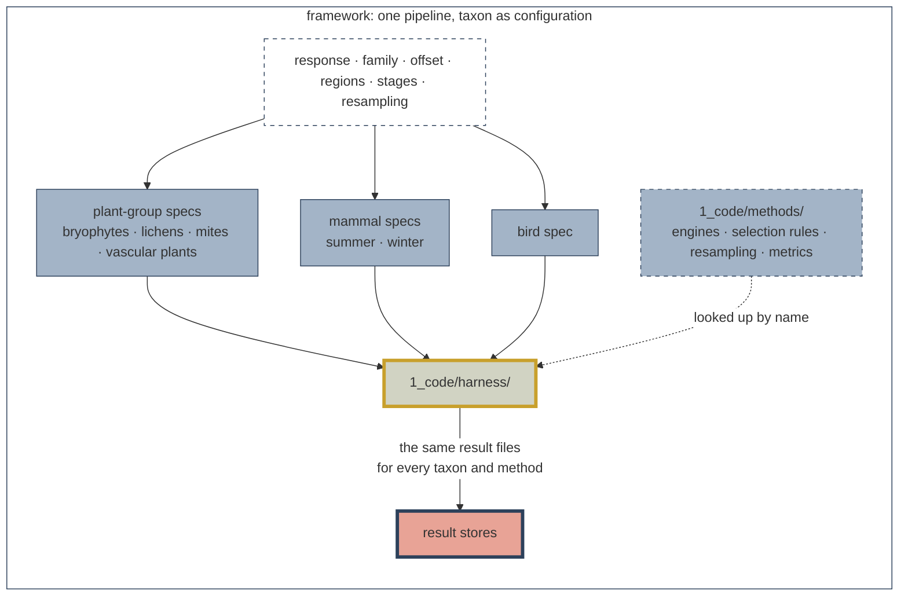
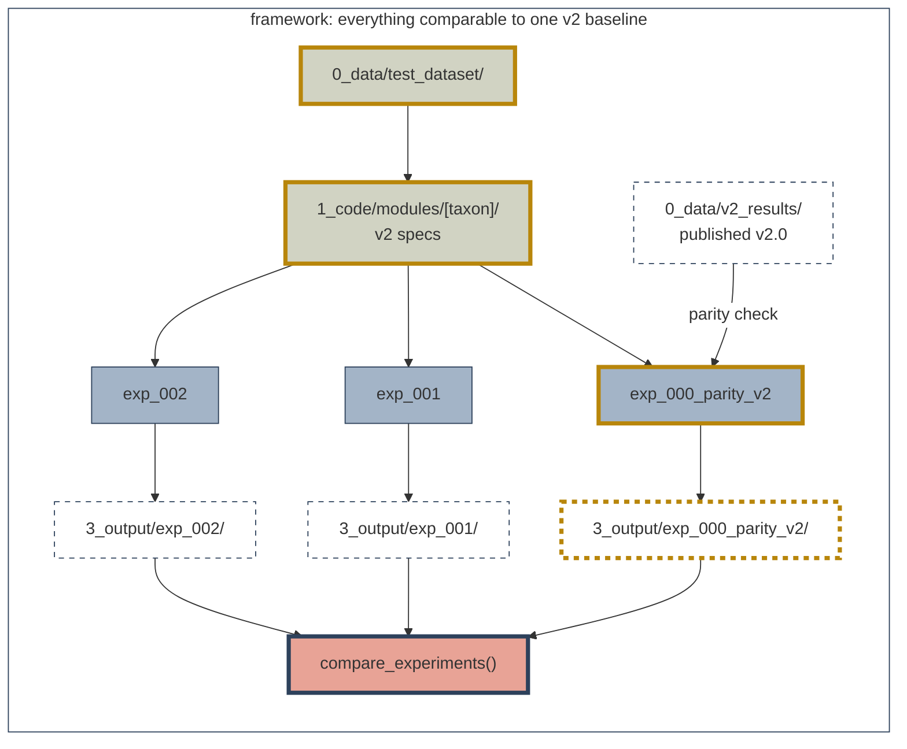

# SDMs Methods Development


> [!IMPORTANT]
> This repository is developed by and for the Science Centre at the Alberta Biodiversity Monitoring
Institute (ABMI). It is intended for internal use.
>

The ABMI Science Centre's shared R&D repository for Species Models 3.0.
It holds a frozen cross-taxa test dataset, one modelling pipeline that
runs every taxon's v2.0 model as a configuration, and a v2 parity check
(`exp_000`) that later experiments are compared against.


**Why this exists**
Species Models are produced one taxon at a time, each by its taxon lead. That
works for production, but it confines R&D to one taxon: a method that improves
plant models may or may not improve bird models, and testing it three times in
three codebases duplicates effort.

This R&D repository is designed to streamline model R&D accross all taxa. It is for testing new methods; it does not produce the final species models or reporting products.

## Repository structure

```
sdmMethodsDev/
├── 0_data/                 # gitignored except v2_scripts/ and *.R
│   ├── test_dataset/       # _setup/ output; runs read the published copy
│   ├── v2_results/         # the v2 parity reference, from _setup/06
│   ├── external/           # downloaded sources (ABMIexploreR), from _setup/06
│   ├── covariates/         # reserved; empty
│   └── v2_scripts/         # v2 scripts as received by toxon leads; reference only
├── 1_code/
│   ├── harness/            # the shared pipeline; names no taxon or method
│   ├── methods/            # engines, selection rules, resampling, metrics
│   ├── modules/            # one v2 spec per taxon; _shared/ for common code
│   ├── experiments/        # one folder per question; _template/, _shared/
│   ├── _setup/             # 00-08: build, check and publish the dataset
│   ├── tests/              # contract tests and the store comparison
│   └── _scratch.R          # dated workspace for exploration
├── 2_pipeline/             # result stores and intermediates; gitignored
├── 3_output/<exp_id>/      # per-experiment outputs; summaries committed
└── docs/                   # getting started, design, taxon quirks, vignettes
```

## How it works
 
‎1_code/_setup/README.md‎
+89Lines changed: 89 additions & 0 deletions

Original file line number	Original file line	Diff line number	Diff line change
@@ -0,0 +1,89 @@
# _setup
Builds the frozen test dataset and the v2 reference in `0_data/`, then
publishes them to ABMI-DATA2. Run by hand, by maintainers, once per
source snapshot. No experiment runs these scripts: experiments read the
published copies (see `harness/data_source.R`).
The scripts read their external inputs from a mirror on
`//ABMI-DATA2/science/sdmMethodsDev/0_data/setup_inputs/`, through
`utils/input_paths.R`, so anyone with access to that share can
rebuild.
## Run
From the repository root:
```r
source("1_code/_setup/run.R")
```
`run.R` runs the steps in dependency order, with on/off switches in
section 1.2, and logs timings to `2_pipeline/_setup/run_log.csv`. `00`,
`03` and `10` are off by default. Run order: `01`, `06`, `09`, `02`,
`03`, `07`, `08`, then `10`. There is no `04` or `05`; they were
retired once `08` replaced them.
## Scripts
| Script | Reads | Writes |
| --- | --- | --- |
| `00_mirror_setup_inputs.R` | Every external input, at its original location | `setup_inputs/` on ABMI-DATA2, with `inputs_manifest.csv`. Run once; never overwrites |
| `01_harmonize_model_ready_v2.R` | The `model_ready_v2` snapshot, mammal camera climate, WildTrax species lookup, v2 prediction matrices, bird `Stratified.Rdata` | `0_data/test_dataset/`: responses, `sites.csv`, `covariates.csv`, `bird_offsets.csv`, and most of `lookup/` |
| `02_validate_test_dataset.R` | The test dataset and the same sources | Nothing; prints a pass / fail tally. Run after `01`, `06` and `09` |
| `03_rerun_bryophyte_v2_reference.R` | v2 plant project bryophyte data, frozen v2 functions in `0_data/v2_scripts/plants/` | `2_pipeline/v2_reference/`: `bryophyte-species-models.Rdata`, `bryophyte-bootstrap-ids.Rdata`. Takes hours |
| `06_harmonize_bird_translation_lookup.R` | v2's bird `Xn-veg-v2024.Rdata` | `lookup/bird_veg_age_matrix.csv`. Re-run whenever `01` rebuilds `lookup/` |
| `07_harmonize_v2_plant_bootstrap_ids.R` | v2's stored plant draws; `03`'s bryophyte draws | `lookup/v2_bootstrap_ids/<taxon>/<species>.rds`, for `plant_bootstrap = "v2_ids"` |
| `08_harmonize_abmiexplorer_results.R` | ABMIexploreR's `species-coefs.RData` at a pinned commit; bird `birdlist.csv` | `0_data/external/abmiexplorer/<sha>/`; `0_data/v2_results/abmiexplorer/v2_results.csv` and `v2_results_coverage.csv` |
| `09_harmonize_lookups.R` | `0_data/test_dataset/lookup/` only; offline, seconds | `species_queue.csv`, `factor_levels.csv`, `dataset_manifest.csv`, bird prediction grids |
| `10_publish_datasets.R` | `0_data/test_dataset/`, `0_data/v2_results/` | A new `<version>/` of each on ABMI-DATA2, with `checksums.csv` and `publish_record.md` |
| `run.R` | The scripts above | Runs them in order |
| `utils/input_paths.R` | | `setup_input()`: paths inside the input mirror |
After `10`, move the pin in `1_code/harness/data_source.R`. A
published version is never overwritten.
## The test dataset
`0_data/test_dataset/` holds the data the v2 models were fitted on. It
does not change between experiments.
| File | Holds |
| --- | --- |
| `sites.csv` | One row per survey unit: identity, design, location, and an `in_<taxon>` flag per taxon |
| `<taxon>.csv` | `survey_unit_id` plus one column per species: detections (plants), densities (mammals), counts (birds) |
| `bird_offsets.csv` | QPAD log offsets per survey unit and bird species |
| `covariates.csv` | Every covariate for every taxon, keyed on `survey_unit_id` and a taxon covariate key |
| `lookup/dataset_manifest.csv` | Per taxon and region: files, covariate key, grid and stored draws. The harness reads file locations only from here |
| `lookup/species_queue.csv` | Every taxon's species queue in one schema |
| `lookup/covariate_columns.csv` | Each covariate's block and v2 spelling, per taxon |
| `lookup/factor_levels.csv` | Source order of categorical levels, so contrasts match v2 |
| `lookup/*_prediction_matrix.csv` | Habitat grids: one row per habitat type, a pure stand |
| `lookup/bird_bootstrap_ids.csv`, `lookup/v2_bootstrap_ids/` | v2's stored draws: birds, and plants per species |
| `lookup/mammal_climate_predictions.csv` | v2's precomputed mammal climate prediction |
| `lookup/bird_veg_age_matrix.csv` | v2's bird landcover translation matrix |
Columns in more than one block are suffixed (`HardLin_veg`,
`HardLin_soil`). Ten derived columns (`TD`, `MAT2`, `Easting2` and
others) are computed on load, not stored. Taxon-specific details are in
[`docs/taxon_quirks.md`](../../docs/taxon_quirks.md).
## Environment variables
Each overrides a default path.
| Variable | Read by | Points at |
| --- | --- | --- |
| `SDM_SETUP_INPUT_ROOT` | `00`–`08` | The input mirror |
| `SDM_SNAPSHOT_V2` | `01`, `02` | The `model_ready_v2` snapshot folder |
| `SDM_MAMMAL_CAMERA_CLIMATE` | `01` | `abmi-camera-climate_2023.Rdata` |
| `SDM_MAMMAL_CLIMATE_PRED` | `01`, `02` | `All Species Climate Predictions.csv` |
| `SDM_V2_LOOKUP` | `01` | The v2 folder holding the plant prediction matrices |
| `SDM_WT_SPECIES` | `01` | `WildTrax Species Strings.RData` |
| `SDM_BIRD_DATA` | `01`, `02` | The bird `Stratified.Rdata` v2 was fitted on |
| `SDM_V2_PROJECT` | `03`, `07` | The v2 plant project (`VegetationModels`) |
| `SDM_V2_BIRD_ROOT` | `06` | The v2 bird project (`BirdModels`) |
| `SDM_V2_BOOT_TAXA`, `SDM_V2_BOOT_SPECIES` | `07` | Comma-separated subsets to copy |
| `SDM_ABMIEXPLORER_SHA` | `08` | The ABMIexploreR commit to download |
| `SDM_V2_BIRD_LOOKUP` | `08` | The v2 bird `birdlist.csv` |
| `SDM_SHARE_ROOT`, `SDM_DATASET_VERSION`, `SDM_PUBLISH` | `10` | Publish root, version folder (default today, `YYYY-MM-DD`), datasets |
‎1_code/experiments/README.md‎
+46Lines changed: 46 additions & 0 deletions

Original file line number	Original file line	Diff line number	Diff line change
@@ -0,0 +1,46 @@
# experiments
One folder per methods question, keyed `exp_NNN_short_description`.
Each folder has a `run.R` entry point that calls `experiment_config()`
and `run_experiment()` (see the [harness README](../harness/README.md)),
and a `README.md` stating the question. The same id names the
experiment's folders in `2_pipeline/` and `3_output/`.
| Folder | Holds | Status |
| --- | --- | --- |
| `_shared/` | `focal_species.R`: `focal_species_sets()`, the named species sets (`full`, `parity_check`, `plants_only`, `one_each`) | |
| `_template/` | The `run.R` and `README.md` that `new_experiment()` fills in | |
| [`exp_000_parity_v2/`](exp_000_parity_v2/README.md) | The v2 parity check and the baseline for every other experiment | Not yet a gate |
| [`exp_001_xgboost/`](exp_001_xgboost/README.md) | Habitat stage fitted with xgboost, every taxon | Test; 5-draw check only |
| [`exp_002_soilgrids/`](exp_002_soilgrids/README.md) | SoilGrids 0–5 cm terms in the climate stage, plants and birds | Test; 5-draw check only |
exp_000 is the required gate before iterative R&D: every other
experiment is compared against its tables.
## Adding an experiment
1. Scaffold it from the repository root:
   ```r
   source("1_code/harness/new_experiment.R")
   new_experiment("covariate scale")  # dry_run = TRUE to preview
   ```
   This takes the next free number across `1_code/experiments/`,
   `2_pipeline/` and `3_output/`, copies `_template/` with the id,
   title, author and date filled in, and creates
   `2_pipeline/<id>/logs/` and `3_output/<id>/` with `figures/`,
   `tables/` and a stub `report.md`. Leave `id` in `run.R` as it is.
2. State the question and design in its `README.md`.
3. Change one thing relative to exp_000: `stage_models`,
   `covariate_files` or `specs`. Keep exp_000's species, draws and seed
   unless they are the question.
4. Never add columns to `0_data/` or change `_setup/` for an
   experiment. Covariates the dataset lacks are written by a script in
   the experiment's folder to `2_pipeline/<id>/inputs/` and named in
   `covariate_files`; `exp_002_soilgrids` is the example.
5. Run it at 5 draws to check it works, then at 100. Compare it with
   an exp_000 run at the same number of draws.
Each lever is walked through in
[`docs/getting_started.md`](../../docs/getting_started.md#test-a-change).
‎1_code/experiments/exp_000_parity_v2/README.md‎
+108-237Lines changed: 108 additions & 237 deletions

Large diffs are not rendered by default.
‎1_code/experiments/exp_001_xgboost/README.md‎
+14-7Lines changed: 14 additions & 7 deletions

Original file line number	Original file line	Diff line number	Diff line change
@@ -24,7 +24,8 @@ draws with tuned settings.

	

- **What changes:** the habitat stage's engine, selection rule and
	
- **What changes:** the habitat stage's engine, selection rule and
  candidate set. `run.R` makes the change with one call for every run:
	
  candidate set. `run.R` makes the change with one call for every run:
  `lapply(standard_specs(), replace_stage_method, engine = "xgboost")`.
	
  `lapply(standard_specs(), replace_stage_method, engine = "xgboost",
  control = xgb_settings)`.
- **Why one formula:** a tree chooses its own variables, splits and
	
- **Why one formula:** a tree chooses its own variables, splits and
  interactions, so it is given every candidate covariate once (as main
	
  interactions, so it is given every candidate covariate once (as main
  effects) rather than v2's competing formulas.
	
  effects) rather than v2's competing formulas.
@@ -54,6 +55,11 @@ From the repository root:
source("1_code/experiments/exp_001_xgboost/run.R")
	
source("1_code/experiments/exp_001_xgboost/run.R")
```
	
```

	

It reads the published test dataset and exp_000's
`3_output/exp_000_parity_v2/tables/`, and writes stores to
`2_pipeline/exp_001_xgboost/` and summaries to
`3_output/exp_001_xgboost/`.
`run.R` uses 5 draws to check the pipeline. For a result, set
	
`run.R` uses 5 draws to check the pipeline. For a result, set
`n_bootstraps = 100`, and make sure the exp_000 tables it is compared
	
`n_bootstraps = 100`, and make sure the exp_000 tables it is compared
against are from a 100-draw run of the same species.
	
against are from a 100-draw run of the same species.
@@ -73,9 +79,10 @@ GLM does, so in-sample metrics would flatter it.
## Assumptions and caveats
	
## Assumptions and caveats

	

- **The xgboost settings are untuned.** At most 1000 rounds, learning
	
- **The xgboost settings are untuned.** At most 1000 rounds, learning
  rate 0.05, depth 3, subsample 0.5, minimum child weight 1. The number of
	
  rate 0.05, depth 3, subsample 0.5, minimum child weight 1 (`run.R`
  rounds is chosen by early stopping on a seeded 20% holdout of each draw,
	
  section 1.2). The number of rounds is chosen by early stopping on a
  then the model is refitted on all of the draw. A fair comparison tunes
	
  seeded 20% holdout of each draw, then the model is refitted on all of
  the draw. A fair comparison tunes
  these, ideally per taxon.
	
  these, ideally per taxon.
- **The grid compares like with like only roughly.** The grid holds each
	
- **The grid compares like with like only roughly.** The grid holds each
  habitat type as a pure stand at `Climate` 0. A GLM extrapolates to that
	
  habitat type as a pure stand at `Climate` 0. A GLM extrapolates to that
@@ -93,9 +100,9 @@ GLM does, so in-sample metrics would flatter it.
- **Bird counts keep the QPAD offset**, which the engine passes as the
	
- **Bird counts keep the QPAD offset**, which the engine passes as the
  base margin in fitting and prediction.
	
  base margin in fitting and prediction.
- **gbm was replaced.** The first version of this experiment
	
- **gbm was replaced.** The first version of this experiment
  (`exp_001_gbm`, 2026-10-03; its output is kept in
	
  (`exp_001_gbm`, 2026-10-03) used `gbm`, which cannot fit the mammal
  `3_output/exp_001_gbm/`) used `gbm`, which cannot fit the mammal hurdle:
	
  hurdle: its bernoulli rejects a 0–1 proportion and it has no Gamma
  its bernoulli rejects a 0–1 proportion and it has no Gamma family.
	
  family.

	

## Result
	
## Result

	

‎1_code/experiments/exp_002_soilgrids/README.md‎
+5Lines changed: 5 additions & 0 deletions

Original file line number	Original file line	Diff line number	Diff line change
@@ -75,6 +75,11 @@ reads the layer from the `//ABMI-DATA2` share; set `SDM_SOILGRIDS` to a local
copy of the raster to read it from there instead. Delete the file to extract
	
copy of the raster to read it from there instead. Delete the file to extract
again.
	
again.

	

It also reads the published test dataset and exp_000's
`3_output/exp_000_parity_v2/tables/`, and writes stores to
`2_pipeline/exp_002_soilgrids/` and summaries to
`3_output/exp_002_soilgrids/`.
`run.R` uses 5 draws to check the pipeline. For a result, set
	
`run.R` uses 5 draws to check the pipeline. For a result, set
`n_bootstraps = 100` and compare against a 100-draw exp_000.
	
`n_bootstraps = 100` and compare against a 100-draw exp_000.

	

‎1_code/harness/README.md‎
+123Lines changed: 123 additions & 0 deletions

Original file line number	Original file line	Diff line number	Diff line change
@@ -0,0 +1,123 @@
# harness
The shared pipeline. It names no taxon and no method: taxon modules
supply specs, `methods/` supplies what the specs name, and the harness
runs them. A change here affects every experiment, past and future;
review it as such and check it with [`1_code/tests/`](../tests/).
Load everything with:
```r
source("1_code/harness/harness.R")
load_framework()  # harness/, methods/, modules/, experiments/_shared/
```
`new_experiment.R` is the exception: it is base R and runs without
`load_framework()`.
## Files
| File | Holds |
| --- | --- |
| `harness.R` | `load_framework()`: sources the harness, methods, modules and `experiments/_shared/`, in that order |
| `experiment.R` | `experiment_config()`, `run_experiment()`, `script_step()` |
| `new_experiment.R` | `new_experiment()`: scaffold an experiment's three folders |
| `data_source.R` | The pinned published dataset versions; `test_dataset_dir()`, `v2_results_dir()`, `verify_published()` |
| `data_load.R` | `lookup/dataset_manifest.csv`, loaders, `covariate_files` joins, model frames |
| `cache.R` | Session cache for dataset reads |
| `covariate_sets.R` | Named covariate sets, derived columns, term renaming |
| `model_sets.R` | v2 candidate formulas, spliced verbatim; `extend_models()`, `models_from_covariates()` |
| `spec.R` | `validate_spec()`, `apply_stage_models()`, `replace_stage_method()` |
| `registry.R` | `register_engine()` and the other `register_*()`; `list_methods()` |
| `engines.R` | Engine interface and `check_engine()` |
| `selection.R` | Plumbing for selection rules: `fit_candidates()`, `combined_predictor()`, `selection_result()` |
| `resample.R` | Per-species seeds, `with_seed()`, spatial blocks |
| `species.R` | Species lists and focal-species resolution |
| `predict_grid.R` | Projects a final model onto a habitat grid |
| `eval_metrics.R` | Scores a prediction with every registered metric |
| `run_model.R` | `run_specs()`: prepare each spec, fit species in parallel, merge shards |
| `result.R` | The result store: writes and reads its files |
| `summarise.R` | `collect_results()`: stores to summary tables |
| `compare.R` | `compare_experiments()`: one experiment against another |
| `run_record.R` | `run_record()`: writes `run_record.md` |
## What `run_experiment()` does
1. **Configure.** `experiment_config()` checks every decision before
   anything is fitted.
2. **Fit.** Every spec is validated and each region's data and grid
   are loaded once. Each species is one job; with `workers` above 1,
   jobs run in parallel R sessions. Each species draws under its own
   seed, so results do not depend on the worker count. A failed
   species or draw is logged and the run continues.
3. **Store.** Shards are merged into one store per run and region in
   `2_pipeline/<id>/`, plus `run_log.csv`.
4. **Summarize.** `collect_results()` writes `3_output/<id>/tables/`.
5. **Compare.** Every experiment except the baseline writes
   `tables/comparison_metrics.csv` against exp_000.
6. **Steps.** The experiment's own `steps`, in order.
7. **Record.** `run_record.md`.
`run_experiment(config, fit = FALSE)` re-summarizes existing stores.
Nothing outside `2_pipeline/<id>/` and `3_output/<id>/` is written.
## `experiment_config()` arguments
| Argument | Default | Sets |
| --- | --- | --- |
| `id` | | Folder name under `2_pipeline/` and `3_output/` |
| `taxa` | all | Runs, from `names(standard_specs())` |
| `species` | every species | A `focal_species_sets()` name, or a vector named by taxon |
| `n_bootstraps` | `100` | Draws per species; v2 used 100. 5 checks a run works |
| `seed` | `20260909` | Base seed; `NULL` leaves draws unseeded, as v2 did |
| `stage_models` | v2's | Replacement candidate sets, keyed `stage` or `taxon.stage` |
| `covariate_files` | none | CSVs of extra covariates keyed on `survey_unit_id` |
| `specs` | `standard_specs()` | Changed specs, such as a different engine or rule |
| `plant_bootstrap` | `"spatial_block"` | `"v2_ids"` replays v2's stored plant draws |
| `workers` | `1` | Species fitted at once |
| `unit_predictions` | `"none"` | `"oob"` or `"all"` writes per-unit predictions |
| `baseline` | `"exp_000_parity_v2"` | Experiment to compare with; `NULL` skips |
| `v2_bootstraps` | `100` | Draws a run needs to be gated |
| `project_root`, `data_dir`, `pipeline_dir`, `out_dir` | derived | Path overrides |
## Outputs
A *draw* is one bootstrap iteration; draw 1 is the full data. Every
summary reduces draws to `median`, `p10` and `p90` (what comparisons
read), plus `mean`, `sd`, `n` and `boot1` (the draw-1 value).
### Result stores: `2_pipeline/<id>/<run>/<region>/`
| File | Holds |
| --- | --- |
| `coefficients.csv` | Every stage's coefficients per species, draw and term |
| `metrics.csv` | Metrics per species and draw |
| `grid_predictions.csv` | The final model's prediction for each habitat type |
| `unit_predictions.csv` | Only with `unit_predictions = "oob"` or `"all"`; several GB for birds |
| `meta.json` | Stages, engines, rules, covariates, resampling, seed, overrides |
`2_pipeline/<id>/run_log.csv` records every species, region and draw:
`ok`, or why not.
### Summary tables: `3_output/<id>/tables/`
| File | One row per | Notes |
| --- | --- | --- |
| `coverage.csv` | run × region | Species, draws and stages written; `species = 0` means nothing ran (see `run_log.csv`) |
| `metric_summary.csv` | taxon × region × species × metric | Prefixes: `insample_`, `oob_` (held-out; NA for draw 1), `v2val_` and `oob_v2val_` (v2's seven plant validation AUCs) |
| `grid_summary.csv` | taxon × region × species × `grid_unit` | Response scale; pure stand at the stage's constants (`Climate` 0) |
| `coefficient_summary.csv` | run × region × stage × species × term | Gitignored. Term meaning varies by taxon and stage |
| `comparison_metrics.csv` | species × metric | Against exp_000; both sides' summaries, the difference, and whether this run did better. Gitignored |
Metrics: `auc`, `deviance_explained`, `rmse`, `spearman`,
`calibration_slope`, `prevalence`, `n`. They score each run's final
model, so for plants `insample_auc` equals `v2val_Full`. "Better" is
higher AUC, deviance explained and Spearman, lower RMSE, and a
calibration slope closer to 1.
## Data access
Runs read the published dataset versions pinned in `data_source.R`
(`sdm_published$versions`), on `//ABMI-DATA2/science/sdmMethodsDev/0_data/`.
Set `SDM_TEST_DATASET` or `SDM_V2_RESULTS` to read another copy. Each
call checks file presence and size; `verify_published()` checks md5.
‎1_code/methods/README.md‎
+8-6Lines changed: 8 additions & 6 deletions

Original file line number	Original file line	Diff line number	Diff line change
@@ -71,7 +71,8 @@ such as `xgboost`'s `objective = "binary:logistic"`, translates it.
### Testing an engine
	
### Testing an engine

	

```r
	
```r
check_engine(engine_mine())
	
check_engine(my_engine())  # a definition, or a registered name
check_engine("glm")
```
	
```

	

`check_engine()` fits small synthetic binomial and Poisson data,
	
`check_engine()` fits small synthetic binomial and Poisson data,
@@ -81,14 +82,15 @@ the engine meets the dataset.

	

### Which rules an engine can use
	
### Which rules an engine can use

	

An engine without an information criterion or coefficients - a
	
An engine without an information criterion or coefficients (a
boosted regression tree, a random forest - can still run any
	
boosted regression tree, a random forest) can still run any
stage, using the `single` rule: one formula, fitted as given. To
	
stage, using the `single` rule: one formula, fitted as given. To
compare it with v2 on a stage v2 fits with model averaging,
	
compare it with v2 on a stage v2 fits with model averaging,
replace that stage's engine, selection and models together. The
	
replace that stage's engine, selection and models together. The
v2 post-processing steps that read coefficients (the plant
	
v2 post-processing steps that read coefficients (the plant
stand-age splines, say) then do not apply, and the stage should
	
stand-age splines, say) then do not apply, and the stage should
drop them; see `docs/getting_started.md`.
	
drop them; see
[`docs/getting_started.md`](../../docs/getting_started.md#2-a-different-engine-or-rule-specs).

	

`replace_stage_method()` does all of this in one call. Its stage
	
`replace_stage_method()` does all of this in one call. Its stage
defaults to the spec's `habitat_stage`, so the same call serves
	
defaults to the spec's `habitat_stage`, so the same call serves
@@ -99,8 +101,8 @@ specs <- lapply(standard_specs(), replace_stage_method,
                engine = "xgboost")
	
                engine = "xgboost")
```
	
```

	

A **composite** rule - one that declares `part_selection`, as
	
A **composite** rule (one that declares `part_selection`, as
`hurdle` does - keeps its place, and the new rule becomes the one
	
`hurdle` does) keeps its place, and the new rule becomes the one
each part runs. The mammal hurdle's structure (presence on every
	
each part runs. The mammal hurdle's structure (presence on every
unit, abundance where the species was found) is a property of the
	
unit, abundance where the species was found) is a property of the
data, so it stays; the new engine fits both halves, and v2's
	
data, so it stays; the new engine fits both halves, and v2's
‎1_code/modules/README.md‎
+78Lines changed: 78 additions & 0 deletions

Original file line number	Original file line	Diff line number	Diff line change
@@ -0,0 +1,78 @@
# modules
One v2 spec per taxon. A module holds configuration, not modelling
code: it states what v2 does for a taxon as a spec list, and the
[harness](../harness/) runs it. A change here affects every
experiment; review it as such.
`load_framework()` sources `_shared/` first, then every other folder,
each in file-name order.
## Files
| Folder | File | Defines |
| --- | --- | --- |
| `_shared/` | `plant_group.R` | `plant_group_spec()`, the builder for the four plant-group taxa, and their v2 post-processing (`plant_age_splines()`, `plant_cutblock_convergence()`, `plant_paspen()`, `plant_footprint_pooling()`) |
| `_shared/` | `standard_specs.R` | `standard_specs(plant_bootstrap)`: every run in its v2 configuration |
| `bryophytes/` | `spec.R` | `bryophyte_spec(use_protocol, bootstrap)` |
| `lichens/` | `spec.R` | `lichen_spec(use_protocol, bootstrap)` |
| `soil_mites/` | `spec.R` | `soil_mite_spec(use_protocol, bootstrap)` |
| `vascular_plants/` | `spec.R` | `vascular_plant_spec(use_protocol, bootstrap)` |
| `mammals/` | `spec.R` | `mammal_spec(climate_source, season, tier)` |
| `mammals/` | `hurdle.R` | v2's hurdle tables: presence and abundance effects, splines, calibration, convergence |
| `birds/` | `spec.R` | `bird_spec()` |
| `birds/` | `standardize.R` | `bird_habitat_translation()`: landcover coefficients onto v2's standardized habitat types (port of v2's `08.PackageCoefficients.R`) |
`standard_specs()` returns seven runs: `bryophyte`, `lichen`, `mite`,
`vascular_plant`, `mammal_summer`, `mammal_winter` and `bird`.
## The module interface
A taxon module must:
1. Define a function `<taxon>_spec(...)` in
   `modules/<taxon_plural>/spec.R` that returns a spec list.
2. Return a spec that passes `validate_spec()`. Unknown fields are
   errors, and every named engine, rule and resampler must be
   registered.
3. Add its run to `standard_specs()` in `_shared/standard_specs.R`.
Spec fields the harness reads (full list: `spec_fields()` in
`harness/spec.R`):
| Field | Sets |
| --- | --- |
| `taxon` | Data slug that keys the response file, covariates and lookups |
| `response_name`, `response_transform`, `family`, `weight_column` | How the recorded value becomes a response; error family; weights |
| `regions` | Per region: `filter` (one-sided formula), `grid`, `habitat_models`, constants |
| `stages` | In order: `name`, `models`, `engine`, `selection`, `ic`, `post_process`, and `carry_as` for the stage carried into the next as `Climate` |
| `habitat_stage` | The stage `replace_stage_method()` replaces by default |
| `resample` | `scheme` and its settings |
| `final_prediction` | Optional. The model scored and projected |
| `v2_coverage` | Per stage, what the spec reproduces of v2. The one place coverage is stated; `report.md` prints it |
| `notes` | Configuration facts, such as whether `Protocol` is fitted |
Fields that a stage's selection rule or resampler takes as arguments
are also accepted, as settings for that method.
## Adding a taxon module
1. Put the v2 scripts as received in `0_data/v2_scripts/<source>/` and
   log the source and commit in its README.
2. Extend `_setup/01` to write the taxon's response, covariates,
   lookups, and any grid or stored draws; extend `_setup/02` to trace
   them to the source.
3. Add the taxon's species queue and manifest rows to `_setup/09`,
   and re-run it.
4. Splice the v2 candidate formulas into `harness/model_sets.R`,
   verbatim.
5. Add `spec.R`, modelled on `lichens/spec.R` (plant group),
   `birds/spec.R` or `mammals/spec.R`, and add the run to
   `standard_specs()`. If v2 does something no registered method
   covers, add one to [`methods/`](../methods/README.md).
6. Add the taxon's published v2 results to `_setup/08`, if
   ABMIexploreR publishes them.
7. Check that `validate_spec()` passes and
   `Rscript 1_code/tests/run_tests.R` runs clean. Record each
   taxon-specific behaviour in
   [`docs/taxon_quirks.md`](../../docs/taxon_quirks.md).
‎1_code/tests/README.md‎
+26Lines changed: 26 additions & 0 deletions

Original file line number	Original file line	Diff line number	Diff line change
@@ -0,0 +1,26 @@
# tests
Checks for any change to `harness/`, `methods/` or `modules/`. Run both
from the repository root.
| File | Does |
| --- | --- |
| `run_tests.R` | Loads the framework and runs `testthat/`. Takes seconds. Dataset checks are skipped when the published dataset cannot be reached |
| `compare_stores.R` | Compares two sets of result stores, matched on keys, to a tolerance (default 1e-10) |
| `testthat/test-dataset.R` | Manifest, species queue, covariate keys, bird grid, covariate cache, `covariate_files` joins |
| `testthat/test-methods.R` | Every engine passes `check_engine()`; registry lookups; metrics |
| `testthat/test-new_experiment.R` | Slugs, numbering and scaffolding of `new_experiment()` |
| `testthat/test-results.R` | Shard merging, seeds, spatial CV folds, baseline comparison, draw summaries |
| `testthat/test-specs.R` | Every standard spec validates; `replace_stage_method()`; hurdle; error reporting; `stage_models` |
```sh
Rscript 1_code/tests/run_tests.R
Rscript 1_code/tests/compare_stores.R <old_dir> <new_dir> [max_boot] [file,file]
```
The tests do not replace the parity check. For a change meant to leave
results alone, run the `parity_check` species at 5 draws to a scratch
folder and compare its stores with exp_000's, as in
[`docs/getting_started.md`](../../docs/getting_started.md#check-that-nothing-broke).
Draws are seeded per species and made in order, so draws 1–5 match
those of a 100-draw run.
‎README.md‎
+132-922Lines changed: 132 additions & 922 deletions

Original file line number	Original file line	Diff line number	Diff line change
@@ -12,99 +12,58 @@
Institute (ABMI). It is intended for internal use.
>
A shared, static cross-taxa test dataset and one modelling pipeline, so that
methods questions for Species Models 3.0 can be asked once and answered for
every taxon, against the same v2.0 baseline.
## Contents
- [Why this repository exists](#why-this-repository-exists)
- [Quick start](#quick-start)
- [Status](#status)
- [How it works](#how-it-works)
  - [One pipeline, taxon as configuration](#one-pipeline-taxon-as-configuration)
  - [Everything is compared with one v2 baseline](#everything-is-compared-with-one-v2-baseline)
  - [What a taxon spec holds](#what-a-taxon-spec-holds)
  - [Methods are plug-ins](#methods-are-plug-ins)
- [The experiment pipeline](#the-experiment-pipeline)
  - [From run.R to results](#from-runr-to-results)
  - [Inside one species job](#inside-one-species-job)
  - [Configuring a run](#configuring-a-run)
- [Building the dataset](#building-the-dataset)
- [Directory structure](#directory-structure)
- [Data: `0_data/`](#data-0_data)
- [Outputs: `2_pipeline/` and `3_output/`](#outputs-2_pipeline-and-3_output)
- [Parity gate](#parity-gate)
- [Known gaps](#known-gaps)
- [Adding an experiment](#adding-an-experiment)
- [Contributing a taxon module](#contributing-a-taxon-module)
- [Naming conventions](#naming-conventions)
- [Setup](#setup)
- [Related resources](#related-resources)
- [Contact](#contact)
## Why this repository exists
Species Models are produced one taxon at a time, each by its taxon lead. That
works for production, but it confines R&D to one taxon: a method that improves
plant models may or may not improve bird models, and testing it three times in
three codebases duplicates effort.
This repository holds:
- a **frozen test dataset** of 10–20 focal species per taxon, harmonized to
  one format (`0_data/test_dataset/`);
- **one pipeline** that runs every taxon's v2.0 model as configuration rather
  than as separate code (`1_code/`);
- **exp_000**, which checks that the pipeline reproduces v2.0, and is the
  baseline every later experiment is compared against.
It is for methods research and development. It does not produce the final
species models or reporting products.
## Quick start
New to the repository? Read [`docs/getting_started.md`](docs/getting_started.md)
first: the vocabulary, how to run the baseline, how to read what it writes,
and how to test a change.
```r
source("1_code/harness/harness.R")
load_framework()          # the harness, every method, every taxon module
list_methods()            # engines, selection rules, resampling, metrics
names(standard_specs())   # the runs an experiment can choose
# The v2 baseline: check the settings at the top of run.R, then
source("1_code/experiments/exp_000_parity_v2/run.R")
```
| To | Start from |
| --- | --- |
| Run the v2 baseline | `1_code/experiments/exp_000_parity_v2/run.R` |
| Test a methods question | A copy of `1_code/experiments/_template/` |
| Add an engine, selection rule, resampling scheme or metric | [`1_code/methods/README.md`](1_code/methods/README.md) |
| Check a code change broke nothing | `Rscript 1_code/tests/run_tests.R`, then [this check](docs/getting_started.md#check-that-nothing-broke) |

## Status

| Component | State |
| --- | --- |
| Test dataset | Built for the four plant-group taxa (bryophytes, lichens, soil mites, vascular plants), mammals and birds. Validated by `_setup/02` |
| v2 reference | Published v2 results harmonized into one table, `0_data/v2_results/` |
| Pipeline | Built: plug-in methods, parallel species, final-model metrics and habitat grids for every taxon, experiment runner, contract tests |
| Taxon specs | Every stage of every taxon runs. What each reproduces of v2 is stated in its spec's `v2_coverage`, printed in `report.md` |
| exp_000 (v2 parity) | At 100 draws on the 14-species `parity_check` set, all 22 taxon × region × stage rows pass the proposed targets. Not yet a gate: see [Parity gate](#parity-gate) |

## How it works

**One pipeline, taxon as configuration**

The three v2.0 pipelines differ in nearly every detail but share one sequence:
pick survey units, fit candidate models, choose among or average them,
predict and score. What differs is the contents of each step. Here those
contents are data, in a **spec** per taxon, and one **harness** runs any spec.
How a model is fitted, selected, resampled or scored is a **method**, looked
up by the name the spec gives.




**Everything is compared with one v2 baseline**
`1_code\experiments\exp_000_parity_v2` runs taxon specs that mirror the v2 modelling methods and produce coeefients in parity with the v2 modelling outputs. Results from the `exp_000_parity_v2` thus serve as a baseline that future experiments can be compared to. I.e.:

exp_000 runs every taxon's v2 spec and checks it against the published
v2.0 output. Every later experiment changes one thing and is compared
with exp_000, so a difference is a difference in method rather than in
plumbing. Because the dataset is frozen, results stay comparable.




The design, the spec and result contracts, and the parity ledger are in
[`docs/framework_design.md`](docs/framework_design.md). Every
taxon-specific v2 behaviour is in
[`docs/taxon_quirks.md`](docs/taxon_quirks.md).

## Getting started

New to the repository? Work through the
[getting-started guide](https://abbiodiversity.github.io/sdmMethodsDev/getting_started.html):
prerequisites and data access, running the v2 baseline (exp_000),
starting an experiment, adding a taxon module, and checking that a
change broke nothing.

## Related resources

- [sciCentRverse](https://github.com/ABbiodiversity/sciCentRverse):
  Science Centre R functions.
- [sciSpatialR](https://github.com/ABbiodiversity/sciSpatialR):
  Science Centre spatial catalogue.

## Contact

For any questions regarding the contents of this repository or data access, please contact Brendan Casey at brendan.casey@ualberta.ca.
