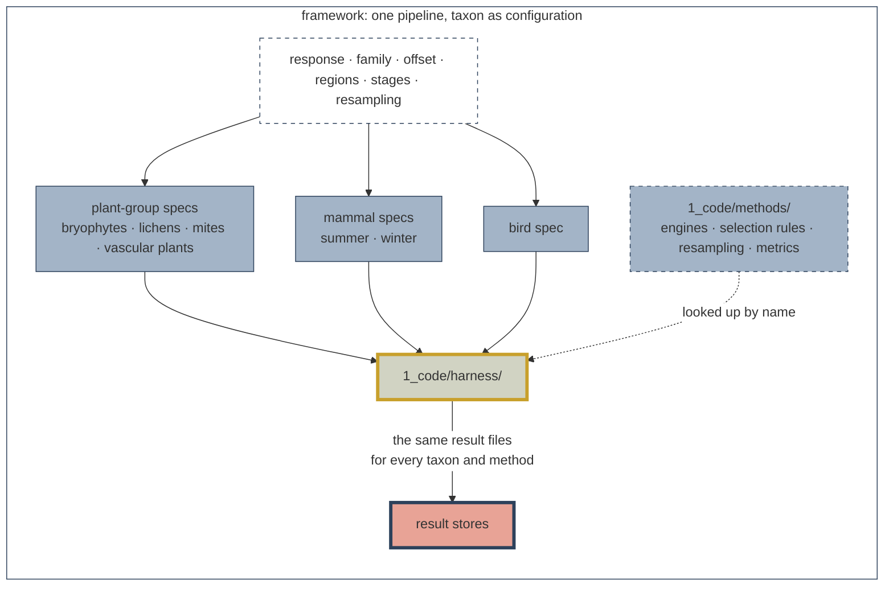
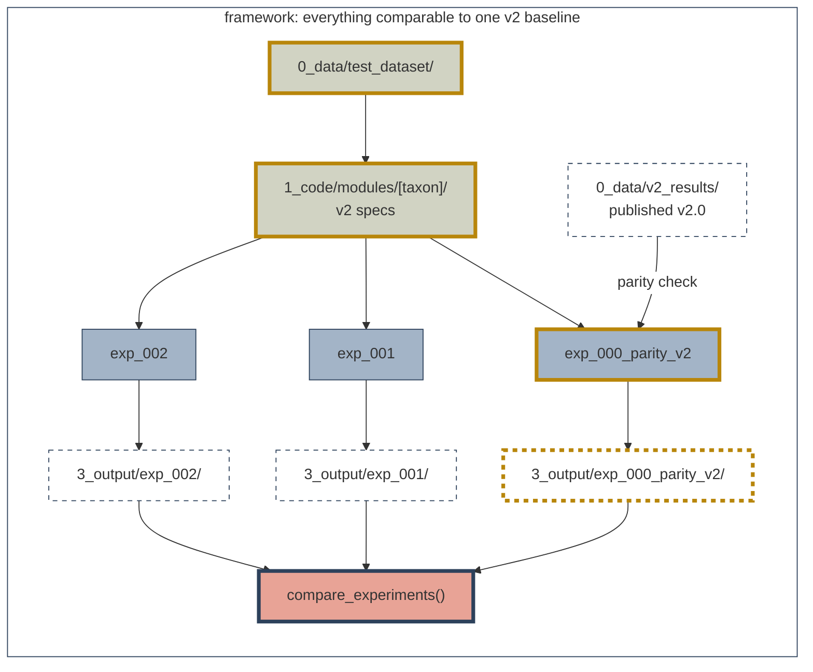

# SDMs Methods Development


> [!IMPORTANT]
> This repository is developed by and for the Science Centre at the Alberta Biodiversity Monitoring
Institute (ABMI). It is intended for internal use.
>

The ABMI Science Centre's shared R&D repository for Species Models 3.0.
It holds a frozen cross-taxa test dataset, one modelling pipeline that
runs every taxon's v2.0 model as a configuration, and a v2 parity check
(`exp_000`) that later experiments are compared against.


**Why this exists**
Species Models are produced one taxon at a time, each by its taxon lead. That
works for production, but it confines R&D to one taxon: a method that improves
plant models may or may not improve bird models, and testing it three times in
three codebases duplicates effort.

This R&D repository is designed to streamline model R&D accross all taxa. It is for testing new methods; it does not produce the final species models or reporting products.

## Repository structure

```
sdmMethodsDev/
├── 0_data/                 # gitignored except v2_scripts/ and *.R
│   ├── test_dataset/       # _setup/ output; runs read the published copy
│   ├── v2_results/         # the v2 parity reference, from _setup/06
│   ├── external/           # downloaded sources (ABMIexploreR), from _setup/06
│   ├── covariates/         # reserved; empty
│   └── v2_scripts/         # v2 scripts as received by toxon leads; reference only
├── 1_code/
│   ├── harness/            # the shared pipeline; names no taxon or method
│   ├── methods/            # engines, selection rules, resampling, metrics
│   ├── modules/            # one v2 spec per taxon; _shared/ for common code
│   ├── experiments/        # one folder per question; _template/, _shared/
│   ├── _setup/             # 00-08: build, check and publish the dataset
│   ├── tests/              # contract tests and the store comparison
│   └── _scratch.R          # dated workspace for exploration
├── 2_pipeline/             # result stores and intermediates; gitignored
├── 3_output/<exp_id>/      # per-experiment outputs; summaries committed
└── docs/                   # getting started, design, taxon quirks, vignettes
```

## How it works

**One pipeline, taxon as configuration**

The three v2.0 pipelines differ in nearly every detail but share one sequence:
pick survey units, fit candidate models, choose among or average them,
predict and score. What differs is the contents of each step. Here those
contents are data, in a **spec** per taxon, and one **harness** runs any spec.
How a model is fitted, selected, resampled or scored is a **method**, looked
up by the name the spec gives.




**Everything is compared with one v2 baseline**

`1_code\experiments\exp_000_parity_v2` runs taxon specs that mirror the v2 modelling methods and produce coeefients in parity with the v2 modelling outputs. Results from the `exp_000_parity_v2` thus serve as a baseline that future experiments can be compared to. I.e.:

exp_000 runs every taxon's v2 spec and checks it against the published
v2.0 output. Every later experiment changes one thing and is compared
with exp_000, so a difference is a difference in method rather than in
plumbing. Because the dataset is frozen, results stay comparable.




## Getting started

New to the repository? Work through the
[getting-started guide](https://abbiodiversity.github.io/sdmMethodsDev/getting_started.html):
prerequisites and data access, running the v2 baseline (exp_000),
starting an experiment, adding a taxon module, and checking that a
change broke nothing.


## Related resources

- [sciCentRverse](https://github.com/ABbiodiversity/sciCentRverse): Science Centre R functions
- [sciSpatialR](https://github.com/ABbiodiversity/sciSpatialR): Science Centre spatial catalogue

## Contact

For any questions regarding the contents of this repository or data access, please contact Brendan Casey at brendan.casey@ualberta.ca.
