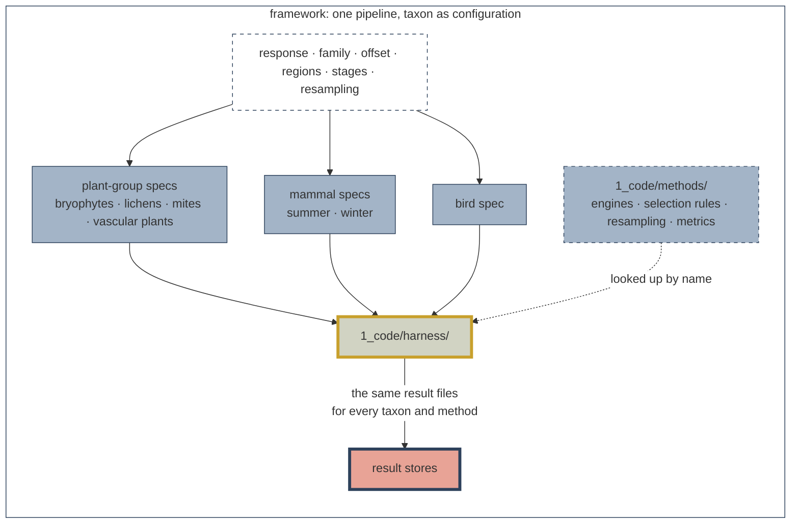
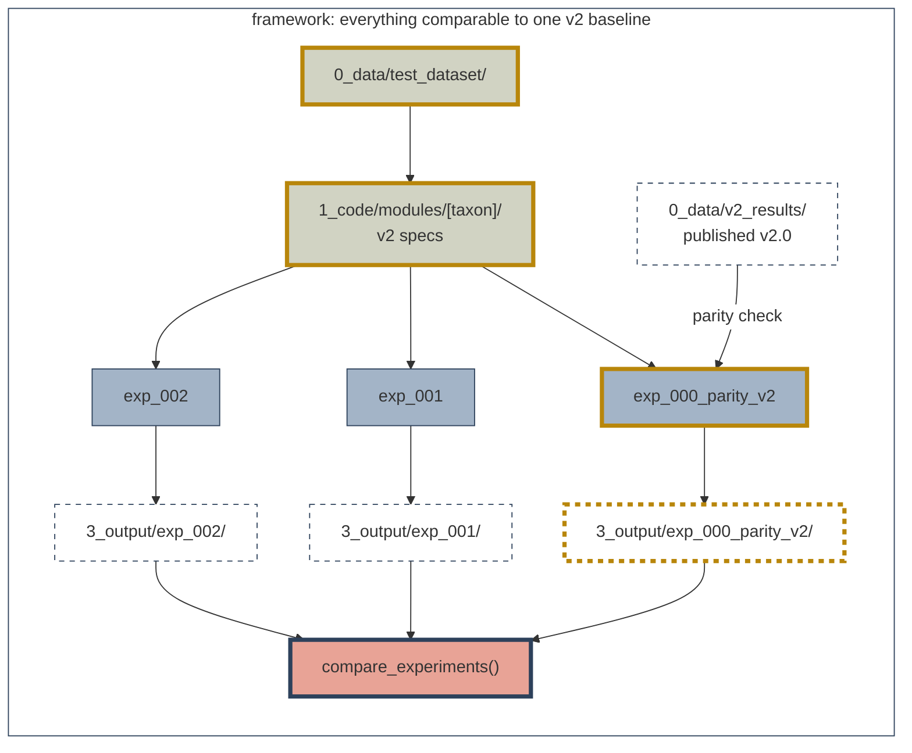
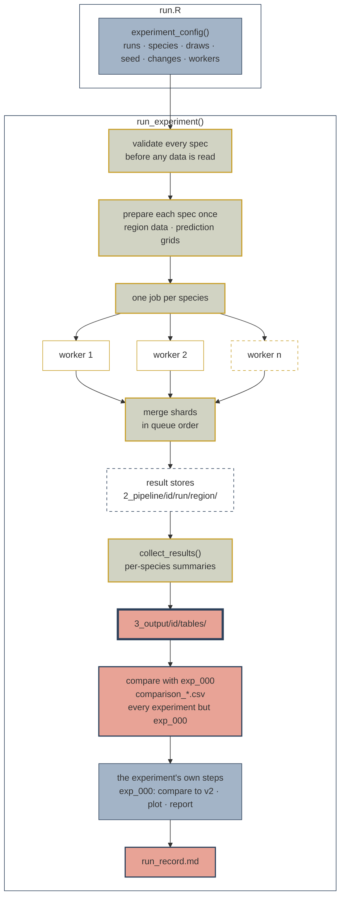
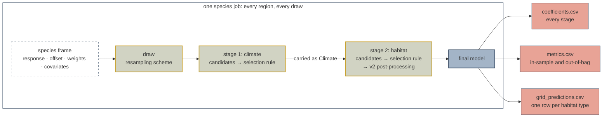
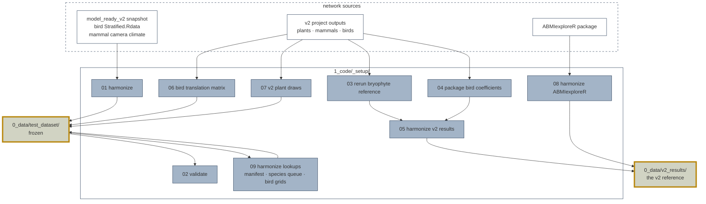
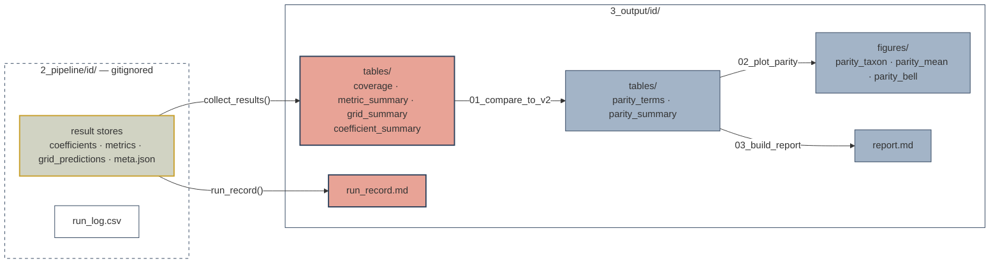

# SDMs Methods Development


> [!IMPORTANT]
> This repository is developed by and for the Science Centre at the Alberta Biodiversity Monitoring
Institute (ABMI). It is intended for internal use.
>

A shared, static cross-taxa test dataset and one modelling pipeline, so that
methods questions for Species Models 3.0 can be asked once and answered for
every taxon, against the same v2.0 baseline.

## Contents

- [Why this repository exists](#why-this-repository-exists)
- [Quick start](#quick-start)
- [Status](#status)
- [How it works](#how-it-works)
  - [One pipeline, taxon as configuration](#one-pipeline-taxon-as-configuration)
  - [Everything is compared with one v2 baseline](#everything-is-compared-with-one-v2-baseline)
  - [What a taxon spec holds](#what-a-taxon-spec-holds)
  - [Methods are plug-ins](#methods-are-plug-ins)
- [The experiment pipeline](#the-experiment-pipeline)
  - [From run.R to results](#from-runr-to-results)
  - [Inside one species job](#inside-one-species-job)
  - [Configuring a run](#configuring-a-run)
- [Building the dataset](#building-the-dataset)
- [Directory structure](#directory-structure)
- [Data: `0_data/`](#data-0_data)
- [Outputs: `2_pipeline/` and `3_output/`](#outputs-2_pipeline-and-3_output)
- [Parity gate](#parity-gate)
- [Known gaps](#known-gaps)
- [Adding an experiment](#adding-an-experiment)
- [Contributing a taxon module](#contributing-a-taxon-module)
- [Naming conventions](#naming-conventions)
- [Setup](#setup)
- [Related resources](#related-resources)
- [Contact](#contact)

## Why this repository exists

Species Models are produced one taxon at a time, each by its taxon lead. That
works for production, but it confines R&D to one taxon: a method that improves
plant models may or may not improve bird models, and testing it three times in
three codebases duplicates effort.

This repository holds:

- a **frozen test dataset** of 10–20 focal species per taxon, harmonized to
  one format (`0_data/test_dataset/`);
- **one pipeline** that runs every taxon's v2.0 model as configuration rather
  than as separate code (`1_code/`);
- **exp_000**, which checks that the pipeline reproduces v2.0, and is the
  baseline every later experiment is compared against.

It is for methods research and development. It does not produce the final
species models or reporting products.

## Quick start

New to the repository? Read [`docs/getting_started.md`](docs/getting_started.md)
first: the vocabulary, how to run the baseline, how to read what it writes,
and how to test a change.

```r
source("1_code/harness/harness.R")
load_framework()          # the harness, every method, every taxon module
list_methods()            # engines, selection rules, resampling, metrics
names(standard_specs())   # the runs an experiment can choose

# The v2 baseline: check the settings at the top of run.R, then
source("1_code/experiments/exp_000_parity_v2/run.R")
```

| To | Start from |
| --- | --- |
| Run the v2 baseline | `1_code/experiments/exp_000_parity_v2/run.R` |
| Test a methods question | A copy of `1_code/experiments/_template/` |
| Add an engine, selection rule, resampling scheme or metric | [`1_code/methods/README.md`](1_code/methods/README.md) |
| Check a code change broke nothing | `Rscript 1_code/tests/run_tests.R`, then [this check](docs/getting_started.md#check-that-nothing-broke) |

## Status

| Component | State |
| --- | --- |
| Test dataset | Built for the four plant-group taxa (bryophytes, lichens, soil mites, vascular plants), mammals and birds. Validated by `_setup/02` |
| v2 reference | Published v2 results harmonized into one table, `0_data/v2_results/` |
| Pipeline | Built: plug-in methods, parallel species, final-model metrics and habitat grids for every taxon, experiment runner, contract tests |
| Taxon specs | Every stage of every taxon runs. What each reproduces of v2 is stated in its spec's `v2_coverage`, printed in `report.md` |
| exp_000 (v2 parity) | At 100 draws on the 14-species `parity_check` set, all 22 taxon × region × stage rows pass the proposed targets. Not yet a gate: see [Parity gate](#parity-gate) |

## How it works

### One pipeline, taxon as configuration

The three v2.0 pipelines differ in nearly every detail but share one sequence:
pick survey units, fit candidate models, choose among or average them,
predict and score. What differs is the contents of each step. Here those
contents are data, in a **spec** per taxon, and one **harness** runs any spec.
How a model is fitted, selected, resampled or scored is a **method**, looked
up by the name the spec gives.



The harness names no taxon and no method. A taxon module contributes only a
spec; an experiment changes parts of a spec or names different methods in it.

### Everything is compared with one v2 baseline



exp_000 runs every taxon's v2 spec and checks the result against the published
v2.0 output. Every later experiment changes one thing and is compared with
exp_000, so a difference is a difference in method rather than in plumbing.
Because the dataset is frozen, results stay comparable over time.

### What a taxon spec holds

A spec is a list returned by a function such as `lichen_spec()`, in
`1_code/modules/<taxon>/spec.R`. It holds no modelling code.

| Field | What it sets |
| --- | --- |
| `taxon` | The data slug that keys the response file, covariates and lookups |
| `response_transform`, `family`, `weight_column` | How the recorded value becomes a response, and the error family and weights |
| `regions` | Per region: the row filter, the prediction grid, and the habitat candidate models |
| `stages` | In order: candidate models, engine, selection rule, information criterion, any rule settings, and which stage's prediction is carried into the next as `Climate` |
| `resample` | The resampling scheme and its settings |
| `final_prediction` | Optional. The model scored and projected; the plant specs name v2's own prediction from its coefficient tables |
| `v2_coverage` | Per stage, whether the spec reproduces v2 and what differs. **The one place coverage is stated**; the report prints it |
| `notes` | Configuration facts, such as whether `Protocol` is fitted |

`validate_spec()` checks every field before a run reads any data. A misspelt
field, an unregistered method, or a selection rule paired with an engine that
cannot serve it stops the run with a sentence saying which.

The covariates a run loads are read off the formulas it fits, so a term can
never be fitted without its column being loaded. The v2 candidate formulas
are in `1_code/harness/model_sets.R`, spliced verbatim from the v2 scripts.

### Methods are plug-ins

Each method is one file in `1_code/methods/` that registers itself under a
name. Adding a method is adding a file; no harness code changes.

| Kind | Folder | Registered |
| --- | --- | --- |
| Engines: how a model is fitted | `methods/engines/` | `glm`, `bayesglm`, `xgboost` (boosted regression trees) |
| Selection rules: how candidates become one result | `methods/selection/` | `single`, `aic_best`, `aic_average`, `staged_bic`, `ivw_grid`, `hurdle` (presence, then abundance given presence; v2 mammals) |
| Resampling: which units each draw fits | `methods/resampling/` | `precomputed`, `spatial_block`, `spatial_cv` |
| Metrics: how a prediction is scored | `methods/metrics/` | `auc`, `deviance_explained`, `rmse`, `spearman`, `calibration_slope`, `prevalence`, `n` |

A selection rule states the engine capabilities it needs (coefficients, an
information criterion, standard errors), and `validate_spec()` checks them.
`replace_stage_method()` swaps one stage of a v2 spec to another engine and
rule, leaving the rest v2's. Each spec names its `habitat_stage`, so one
call serves every taxon, mammals included: the mammal hurdle keeps its
presence-then-abundance structure and the new engine fits both halves.
`exp_001_xgboost` uses it to fit the habitat stage with boosted regression
trees. `extend_models()` adds terms to every
candidate in a model set, and `covariate_files` supplies terms the dataset
does not hold; `exp_002_soilgrids` uses both to add SoilGrids soil
properties to the climate stage.
`check_engine()` tests a new engine against the contract on synthetic data.
The contracts are in [`1_code/methods/README.md`](1_code/methods/README.md).

## The experiment pipeline

### From run.R to results

An experiment is a `run.R` that states its decisions in `experiment_config()`
and calls `run_experiment()`. Everything after that is the same for every
experiment.



1. **Configure.** `experiment_config()` holds every decision and checks it
   before anything is fitted.
2. **Prepare.** Each spec is validated, and each region's data and grid are
   loaded once.
3. **Fit.** Every species of every spec is one job; with `workers` above 1
   the jobs run in parallel R sessions. Each species draws under its own
   seed, so results are the same on one worker or twelve. A failed species
   or draw is logged and the run continues.
4. **Store.** Each job writes a shard; the shards are merged into one result
   store per run and region in `2_pipeline/<id>/`.
5. **Summarize.** `collect_results()` reduces the stores to per-species
   tables in `3_output/<id>/tables/`.
6. **Compare with exp_000.** Every experiment except exp_000 itself is
   compared with the v2 baseline: `tables/comparison_*.csv`, with the
   headline printed. Set `baseline = NULL` in `experiment_config()` to skip.
7. **The experiment's own steps**, in order. For exp_000: compare with v2,
   plot, write the report.
8. **Record.** `run_record.md` says what ran, for the commit.

Nothing outside `2_pipeline/<id>/` and `3_output/<id>/` is written during a
run, and `0_data/` is never written outside `1_code/_setup/`.

### Inside one species job



Plants and birds fit climate, then habitat (birds: landcover), carrying the
climate prediction into the habitat stage as a term called `Climate`, as v2
does. The **final model** is the averaged or combined one where a rule
combines candidates, and for plants v2's own prediction from its coefficient
tables. Metrics score it in-sample and on the units the draw left out
(out-of-bag). The **grid** holds its prediction for a pure stand of each
habitat type, the one quantity every engine can produce, so it is what a
method without coefficients is compared on.

### Configuring a run

`run.R` is the only file to edit. Its `experiment_config()` call holds every
decision:

| Argument | Sets |
| --- | --- |
| `id` | The experiment's folders under `2_pipeline/` and `3_output/` |
| `taxa` | The runs, from `names(standard_specs())` |
| `species` | A named set from `focal_species_sets()`, a vector named by taxon, or `NULL` for every species |
| `n_bootstraps` | Draws per species; 100 is v2's. Use 5 to check that a run works |
| `seed` | The base seed; `NULL` leaves draws unseeded, as v2 did |
| `stage_models` | Replacement candidate formulas, or `NULL` for v2's |
| `specs` | Changed specs (a different engine or selection rule), or `NULL` for `standard_specs()` |
| `plant_bootstrap` | `"spatial_block"` draws v2's bootstrap afresh; `"v2_ids"` replays v2's stored draws |
| `workers` | Species fitted at once |
| `unit_predictions` | `"none"` (default), `"oob"` or `"all"` per-unit predictions written |

Shorten a trial by cutting species, not draws: a 10–90% band read from a
handful of draws does not mean much. On a 24-core machine, the 14
`parity_check` species take about 1.6 minutes at 5 draws on 12 workers.

## Building the dataset

The dataset is built once per source snapshot by the scripts in
`1_code/_setup/`, run by hand and in order. No experiment runs them.
The built dataset and v2 results are then published to ABMI-DATA2
(`10`), and experiments read those copies, so only whoever rebuilds the
data runs `_setup/`. The scripts read their inputs from a mirror on the
same share (`00`), so anyone with access to it can rebuild.



| Script | Reads | Writes |
| --- | --- | --- |
| `00_mirror_setup_inputs.R` | Every external input below, at its original location | `setup_inputs/` on ABMI-DATA2, with `inputs_manifest.csv`; run once |
| `01_harmonize_model_ready_v2.R` | The `model_ready_v2` snapshot, the mammal camera climate, the WildTrax species lookup, the v2 prediction matrices, the bird `Stratified.Rdata` | `0_data/test_dataset/` |
| `02_validate_test_dataset.R` | The test dataset and the same sources | Nothing; prints a pass / fail tally |
| `03_rerun_bryophyte_v2_reference.R` | The v2 plant project's bryophyte data, and the frozen v2 functions | `2_pipeline/v2_reference/bryophyte-species-models.Rdata` |
| `04_package_bird_coefficients.R` (legacy) | The per-draw v2 bird coefficient CSVs | `2_pipeline/v2_reference/Birds2024.RData` |
| `05_harmonize_v2_results.R` (legacy) | v2 plant `COEFS.RData`, the mammal coefficient tables, `Birds2024.RData` | `0_data/v2_results/` |
| `06_harmonize_bird_translation_lookup.R` | v2's bird `Xn-veg-v2024.Rdata` | `lookup/bird_veg_age_matrix.csv` |
| `07_harmonize_v2_plant_bootstrap_ids.R` | v2's stored plant bootstrap draws | `lookup/v2_bootstrap_ids/` |
| `08_harmonize_abmiexplorer_results.R` | ABMIexploreR's packaged coefficients | `0_data/v2_results/abmiexplorer/` |
| `09_harmonize_lookups.R` | `0_data/test_dataset/lookup/` only (offline) | `species_queue.csv`, `factor_levels.csv`, `dataset_manifest.csv`, the bird prediction grids |
| `10_publish_datasets.R` | `0_data/test_dataset/`, `0_data/v2_results/` | A new `<version>/` of each on ABMI-DATA2, with `checksums.csv` |

- **`00`** copies every external file `_setup/` reads to
  `//ABMI-DATA2/science/sdmMethodsDev/0_data/setup_inputs/`, unchanged and
  under each source's own relative paths, and records each copy's origin
  and md5 in `inputs_manifest.csv`. The originals are left in place. The
  scripts read the mirror by default (`_setup/utils/input_paths.R`); their
  `SDM_*` variables still point them back at the originals. It never
  overwrites the mirror: a source that has changed since is reported.

- **`01`** writes every response, covariate and lookup table, so experiments
  run from `0_data/test_dataset/` alone. Mammal species names are resolved
  against `WildTrax Species Strings.RData`, so the north and south files
  reach the same column name.
- **`02`** is run after `01`, `06` and `09`, and whenever the snapshot or a
  harmonizer changes. It traces every written value back to its source,
  restating the rules rather than calling the harmonizer, so a bug there
  shows up rather than cancelling out. It writes nothing.
- **`03`** exists because the published bryophyte reference is unusable:
  every draw is an error object. It re-runs the frozen v2 functions
  unmodified, climate stage only.
- **`04`** rebuilds the packaged bird output, absent from the bird drive. It
  is v2's `08.PackageCoefficients.R` with only the paths changed. **`04`
  and `05` are legacy:** parity is scored against `08`'s ABMIexploreR
  build, which agrees with theirs to about 1e-15 on shared species. Their
  output is kept and published frozen in `v2_results/`, and their inputs
  (hours of Google Drive reads, and ~38 GB of bird model objects) are not
  mirrored.
- **`05`** flattens the three v2 storage formats into one table. Mammal
  results average the two seasons, as v2's `.all` tables do.
  `Birds2024.RData` labels draws 2 to 100 in file-listing order (`b2` is draw
  10), a v2 packaging quirk: medians and bands are unaffected.
- **`06`** copies the matrix v2 uses to translate bird landcover coefficients
  onto the standardized habitat types. Re-run it whenever `01` rebuilds
  `lookup/`.
- **`07`** copies v2's stored plant draws, so `plant_bootstrap = "v2_ids"`
  fits exactly the rows v2 fitted. The sets are large (1.3 GB for vascular
  plants); `SDM_V2_BOOT_TAXA` and `SDM_V2_BOOT_SPECIES` restrict it.
- **`08`** harmonizes ABMIexploreR's published coefficients, pinned to a
  commit; exp_000 scores against this build by default.
- **`09`** writes one form of the lookups for every taxon: one species queue
  (the three taxon leads' lookups had three schemas), one factor-level table,
  the bird habitat grids, and `dataset_manifest.csv`, which names each
  taxon's files. The harness reads file locations from the manifest and
  nowhere else. It runs offline in seconds; re-run it after `01` or `06`.
- **`10`** publishes `0_data/test_dataset/` and `0_data/v2_results/` as a
  new version folder each (default: today's date), copied to a `.partial`
  folder, checked by md5 and only then renamed into place. A published
  version is never overwritten. Point experiments at it by changing the
  pin in `1_code/harness/data_source.R`.

## Directory structure

```
sdmMethodsDev/
├── README.md
├── 0_data/                        # _setup/ output; experiments read the published copy
│   ├── test_dataset/              # the frozen dataset; see "Data" below
│   ├── v2_results/                # the published v2 results, one table
│   ├── v2_scripts/                # the v2 scripts as received; reference only
│   └── covariates/                # reserved for a covariate catalogue; empty
│
├── 1_code/
│   ├── harness/                   # the shared pipeline; names no taxon or method
│   │   ├── harness.R              # load_framework(): loads everything
│   │   ├── experiment.R           # experiment_config(), run_experiment()
│   │   ├── run_model.R            # run_specs(): prepare, fit (parallel), merge
│   │   ├── spec.R                 # validate_spec() and spec helpers
│   │   ├── registry.R             # register_*(), list_methods()
│   │   ├── data_load.R            # the dataset manifest, loaders, model frames
│   │   ├── summarise.R            # collect_results()
│   │   ├── compare.R              # compare_experiments()
│   │   └── …                      # model sets, selection, engines, metrics, grids, stores
│   ├── methods/                   # one file per method; see its README
│   │   ├── engines/  selection/  resampling/  metrics/
│   │   └── _templates/            # copy-and-fill skeletons; not loaded
│   ├── modules/                   # one v2 spec per taxon
│   │   ├── _shared/               # plant_group.R (four plant taxa); standard_specs.R
│   │   ├── bryophytes/  lichens/  soil_mites/  vascular_plants/
│   │   ├── mammals/               # spec.R, hurdle.R (v2's hurdle tables)
│   │   └── birds/                 # spec.R, standardize.R (v2's term translation)
│   ├── experiments/
│   │   ├── _shared/               # named focal-species sets
│   │   ├── _template/             # copy to start an experiment
│   │   ├── exp_000_parity_v2/     # run.R, 01_compare_to_v2.R, 02_plot_parity.R,
│   │   │                          # 03_build_report.R, utils/parity_targets.R
│   │   ├── exp_001_xgboost/       # test: habitat stage fitted with xgboost
│   │   └── exp_002_soilgrids/     # test: SoilGrids terms in the climate stage;
│   │                              # 01_extract_soilgrids_covariates.R, run.R
│   ├── _setup/                    # 00–10: mirror inputs, build the v2 data in
│   │                              # 0_data/, publish it to ABMI-DATA2; fixed
│   ├── tests/                     # run_tests.R; compare_stores.R
│   └── _scratch.R                 # dated workspace for exploration
│
├── 2_pipeline/                    # result stores and intermediates; gitignored
│   ├── <exp_id>/<run>/<region>/   # one result store per run and region
│   └── v2_reference/              # rebuilt v2 references, from _setup/03 and 04
│
├── 3_output/                      # deliverables, per experiment; summaries committed
│   └── <exp_id>/                  # tables/, figures/, report.md, run_record.md
│
└── docs/
    ├── getting_started.md         # start here
    ├── framework_design.md        # the design, contracts and parity ledger
    ├── taxon_quirks.md            # every taxon-specific v2 behaviour
    └── reviews/                   # dated code reviews
```

| Folder | Edit it to | Affects |
| --- | --- | --- |
| `1_code/experiments/exp_NNN_*/` | Ask a question | That experiment only |
| `1_code/experiments/_shared/` | Add a reusable species set | Experiments that use it |
| `1_code/methods/` | Add or change a method | Every experiment that names it |
| `1_code/modules/<taxon>/` | Record what v2 does for a taxon | Every experiment; review as such |
| `1_code/harness/` | Change how every run works | Every experiment, past and future; review as such |
| `1_code/_setup/` | Rebuild or extend the dataset | The dataset, and so every experiment |

## Data: `0_data/`

Gitignored except `v2_scripts/`. `test_dataset/` and `v2_results/` are
built here by `_setup/`, then published to ABMI-DATA2 as versioned,
checksummed copies:

```
//ABMI-DATA2/science/sdmMethodsDev/0_data/
├── test_dataset/<version>/   # + checksums.csv, publish_record.md
├── v2_results/<version>/
└── setup_inputs/             # _setup/'s inputs; see "Building the dataset"
```

**Experiments, tests and downstream scripts read the published copies,**
through `test_dataset_dir()` and `v2_results_dir()` in
[`1_code/harness/data_source.R`](1_code/harness/data_source.R). That file
pins the version every run reads, and each run record names it. Every call
checks the published files are present at their published sizes;
`verify_published()` checks them by md5. To read another copy (a local one
for working off the network, or `0_data/` straight after a rebuild), set
`SDM_TEST_DATASET` or `SDM_V2_RESULTS` to its folder.

### `test_dataset/`

The frozen cross-taxa dataset: the data the v2 models were fitted on. It
does not change between experiments, and neither do the `_setup/` scripts
that build it; a rebuild happens only when the v2 sources change, checked by
`_setup/02`. Anything an experiment adds lives in that experiment's folder.

| File | Holds |
| --- | --- |
| `sites.csv` | One row per survey unit across every design: identity, design and location fields, and an `in_<taxon>` flag per taxon |
| `<taxon>.csv` | `survey_unit_id` plus one column per species: detections for plants, densities for mammals, counts for birds. Join to `sites.csv` on `survey_unit_id` |
| `bird_offsets.csv` | QPAD log offsets per survey unit and bird species |
| `covariates.csv` | Everything the models regress against, every taxon, in one wide table keyed on `survey_unit_id` and a covariate key |
| `lookup/dataset_manifest.csv` | Per taxon and region: the response and offset files, the covariate key, the prediction grid, and any stored draws. **The harness reads file locations from here** |
| `lookup/species_queue.csv` | Every taxon's work queue in one schema: taxon, region, season, tier, species, order, and the name v2 used |
| `lookup/covariate_columns.csv` | Per taxon, the block each covariate came from (climate, veg, soil, design) and its v2 spelling |
| `lookup/factor_levels.csv` | The source order of categorical levels, so reference levels and every contrast match v2 |
| `lookup/*_prediction_matrix.csv` | Habitat prediction grids: one row per habitat type, the cover of a pure stand. Plants (`veg`, `soil`), mammals and birds |
| `lookup/bird_bootstrap_ids.csv`, `lookup/v2_bootstrap_ids/` | v2's stored draws: birds, keyed on `surveyid`; plants per species |
| `lookup/mammal_climate_predictions.csv` | The climate offset v2's mammal habitat models read from a separate climate pipeline; the mammal specs read it by default |
| `lookup/bird_veg_age_matrix.csv` | v2's bird landcover translation matrix |

Things to know about the data:

- **Covariate keys include the taxon,** because the sources disagree: mites
  differ from the other plant-group taxa on shared survey units, and mammals
  are keyed per region (`mammal_north`, `mammal_south`) because north and
  south are separate models on overlapping deployments.
- **A column in more than one block was suffixed** (`HardLin_veg`,
  `HardLin_soil`); the harness renames model terms to match, so v2 formulas
  run unchanged.
- **Ten derived columns are not stored** (`TD`, `MAPPET`, `MAT2`, `CMDMAT`,
  `MWMT2`, `Easting`, `Northing`, `Easting2`, `Northing2`,
  `EastingNorthing`). The harness computes them on load, so a squared term
  always equals its square.
- **Mammal climate** comes from `abmi-camera-climate_2023.Rdata`, the file
  v2's mammal climate pipeline fitted against. It matched 4,243 of 4,654
  north deployments and all 1,168 south; unmatched deployments carry `NA`, as
  v2 excludes them.
- **The bird grids** are v2's translation matrix rebuilt in covariate space
  by `_setup/09`, checked to reproduce it exactly.
- **Covariates v2 did not use are not added here.** An experiment that
  tests new covariates extracts them with a script in its own folder, writes
  them to `2_pipeline/<id>/inputs/` keyed on `survey_unit_id`, and names that
  file in `experiment_config(covariate_files = )`; the harness joins it on
  load. `exp_002_soilgrids` is the example.

### `v2_results/`

The published v2 results as one long table, so a run is scored against one
file rather than three storage formats on two drives: `taxon`, `region`,
`stage`, `part`, `season`, `species`, `species_v2`, `term`, `v2_median`,
`v2_p10`, `v2_p90`, `v2_se`, `v2_n` and `source`. Plant climate is fitted once
province-wide in v2, so those rows carry `region = "all"`. Two builds share the
schema: `abmiexplorer/` (the published species, from `_setup/08`; exp_000's
default) and the network-drive build (every species v2 fitted, from
`_setup/05`). `v2_results_coverage.csv` records which source each part came
from.

### `v2_scripts/`

The modelling scripts as received from the taxon leads, unmodified, one
subfolder per source repository, snapshotted on 2026-09-08. They are the
reference the pipeline is checked against and are **never run**. Sources and
commits are in [`0_data/v2_scripts/README.md`](0_data/v2_scripts/README.md).
The v2 method is restated here rather than copied: what differed between the
v2 scripts became spec fields, what they shared became harness code, and the
candidate formulas were spliced verbatim.

## Outputs: `2_pipeline/` and `3_output/`



The red files are written for every experiment by the harness; the blue ones
are exp_000's own steps. Every other experiment also writes
`comparison_*.csv` against exp_000.

A *draw* is one bootstrap iteration; draw 1 is the full data. Every summary
reduces the draws to a median and a 10th–90th percentile band (`p10`, `p90`)
rather than a mean and standard deviation, because the spread over draws is
often skewed. `boot1` is the draw-1 value.

### Result stores (`2_pipeline/<exp_id>/<run>/<region>/`)

| File | Holds |
| --- | --- |
| `coefficients.csv` | Every stage's coefficients per species, draw and term |
| `metrics.csv` | Metrics per species and draw |
| `grid_predictions.csv` | The final model's prediction for each habitat type |
| `unit_predictions.csv` | Only when `unit_predictions` is `"oob"` or `"all"`: predictions at survey units. Off by default: several GB for birds |
| `meta.json` | What produced the store: stages, engines, selection rules, covariates, resampling, the seed, any model overrides |

`2_pipeline/<exp_id>/run_log.csv` records every species, region and draw:
`ok`, or why not.

### What is committed

| Committed | Gitignored (rebuilt with `run_experiment(config, fit = FALSE)`) |
| --- | --- |
| `run_record.md`, `report.md` | `figures/` |
| `tables/coverage.csv` | `tables/coefficient_summary.csv` |
| `tables/metric_summary.csv` | `tables/parity_terms.csv` |
| `tables/grid_summary.csv` | `tables/comparison_metrics.csv` |
| `tables/comparison_summary.csv`, `tables/comparison_grid.csv` (experiments after exp_000) | |
| `tables/parity_summary.csv`, `tables/v2_self_agreement_summary.csv` | |

**Commit only runs that count.** A trial writes the same files as a full run.
Commit `3_output/` after a run with the full species list and
`n_bootstraps = 100`, and check that `run_record.md` says so. Output folders
are named by experiment rather than by version; each experiment is its own
record, and its history is in git.

### Tables written for every experiment

**`run_record.md`** — what ran. Read it first: if it is not a full run, the
tables describe a trial.

| Section | Holds |
| --- | --- |
| Provenance | Git commit, R version, time written. Volatile; ignored when comparing records |
| Configuration | Runs, focal species, draws, seed, candidate model sets, engines, selection rules, jobs ok / not ok |
| Coverage | Rows written per run and region |
| Metrics | Metrics pooled over species and draws: median, 10–90% band, mean and standard deviation |

**`tables/coverage.csv`** — what ran, one row per run × region: `taxon`,
`run`, `region`, `season` and `part` (mammals), `species`, `draws`, `stages`,
`has_coefficients`, `has_grid`. A row with `species = 0` produced nothing;
the reason is in `run_log.csv`.

**`tables/metric_summary.csv`** — how well the models fit. One row per
taxon × region × species × metric, with `n`, `median`, `p10`, `p90`,
`boot1`, `mean` and `sd` over draws. The median and band are what comparisons
read, because the spread over draws is often skewed; the mean and standard
deviation are there for readers and tools that expect them.

| Prefix | Scored on |
| --- | --- |
| `insample_` | The units the draw fitted |
| `oob_` | The units the draw left out: the held-out read. NA for draw 1 |
| `v2val_` | v2's own validation (plants): seven AUCs from the coefficients |
| `oob_v2val_` | The same seven, out-of-bag |

| Metric | Meaning |
| --- | --- |
| `auc` | Separation of detections from non-detections; 0.5 is chance, 1 is perfect |
| `deviance_explained` | Share of the null deviance the model explains |
| `rmse` | Typical prediction error |
| `spearman` | Rank agreement between observed and predicted |
| `calibration_slope` | 1 is well calibrated; below 1, predictions are over-confident |
| `prevalence`, `n` | Observed detection rate; survey units scored |
| `Climate` … `Full_Joint_Truncated` | v2's seven validation AUCs: climate alone (and capped), landcover alone, the two combined, and combined per habitat type |

Metrics score each run's final model, so for plants `insample_auc` equals
`v2val_Full`. Runs before 2026-10-03 scored the best single candidate; their
metric summaries are not comparable with these.

**`tables/grid_summary.csv`** — the final model's prediction for each
habitat type, one row per taxon × region × species × `grid_unit`, on the
response scale. Each row is a pure stand of that type at the stage's
constants (`Climate` 0, the new protocol where fitted, 100 sampling days for
mammals). v2's later coefficient adjustments, such as the plant stand-age
splines, are in the coefficients, not the grid.

**`tables/coefficient_summary.csv`** (gitignored) — one row per run ×
region × stage × species × term. A term means something different by taxon
and stage:

| Taxon and stage | `term` holds |
| --- | --- |
| Any, `climate` | Model-averaged climate coefficients, link scale |
| Plant group, `habitat` | Effect of each habitat type, logit scale, plus `Intercept`, `Climate` and, for bryophytes and lichens, `Protocol` |
| Mammals, `habitat_presence` / `_abundance` / `_total` | Per habitat type, from v2's hurdle model |
| Birds, `landcover` | Raw `glm` coefficients (e.g. `vegcCrop`) |
| Birds, `habitat` | The same, translated onto v2's standardized habitat types, log scale |

**`tables/comparison_*.csv`** (every experiment except exp_000) — against
exp_000, written automatically by `run_experiment()`: `comparison_summary.csv` per taxon, region and metric, with the
median difference, the share of species that did better, and each side's
draw count (a mismatch is warned about);
`comparison_metrics.csv` per species, with both sides' median, band, mean and
standard deviation; `comparison_grid.csv` with the rank
correlation of habitat effects on the grid. "Better" is higher AUC, deviance
explained and Spearman, lower RMSE, and a calibration slope closer to 1.

### exp_000's parity outputs

**`tables/parity_terms.csv`** (gitignored) — the term-by-term comparison:
`coefficient_summary.csv` joined to the v2 reference on taxon, region, stage,
part, species and term, with plant habitat terms relabelled as v2 publishes
them and mammal seasons averaged.

| Column | Meaning |
| --- | --- |
| `ref_region`, `ref_part` | The reference rows joined to; climate joins region `all` |
| `median`, `p10`, `p90`, `boot1`, `n` | This run over draws |
| `v2_median`, `v2_p10`, `v2_p90`, `v2_n`, `source` | v2's summary; `v2_n = 1` means v2 fitted once |
| `comparison`, `run_value` | `median`, or `iteration 1` where v2 fitted once, and the value used |
| `reachable`, `unreachable_reason` | Whether v2 fixes the term at a placeholder |
| `in_band` | `TRUE` where the v2 median falls inside this run's `p10`–`p90` band |
| `absolute_difference`, `standardized_difference` | The gap, raw and ÷ half this run's band. Below 1 is close |

**`tables/parity_summary.csv`** — the gate, one row per taxon × region ×
stage: `species`, `terms_compared`, `min_draws`, `in_band_pct`,
`reachable_terms`, `reachable_in_band_pct`, the median and maximum gaps,
`negligible_terms`, `median_spearman` (reported, not gated),
`median_band_ratio` (this run's band width ÷ v2's; gated between 0.75 and
1.33), `verdict` and `indicative_verdict` (a 100-draw run on a species
subset: the same test, **not** the gate).

**`figures/`** — `parity_<taxon>.png` draws each term's run and v2 median
and 10–90% band, relative to v2 (0 is v2's median, one unit half v2's band);
`parity_mean.png` averages them per taxon; `parity_bell.png` shows v2 and the
run as distributions, so a shift is a difference in location and a wider or
narrower curve a difference in spread.

**`report.md`** — generated: run kind and seed, what each spec reproduces of
v2, the v2 references reached, what ran, parity by stage, and model fit.

## Parity gate

exp_000 is the validation gate: it runs every taxon's v2.0 configuration
through the pipeline and compares the result with the published v2.0 output.

v2 sets no random seed, so two v2 runs of the same code give different
coefficients, and parity is **distributional**: each term passes when the v2
median falls inside this run's 10–90% band. Where v2 fits once (mammals), the
run's full-data fit is compared directly. The proposed targets, in
`utils/parity_targets.R`, are set from how closely two v2 runs agree with each
other (`v2_self_agreement.R`): at least 90% of reachable terms in band, a
median standardized difference of 0.25 or less, and a band-width ratio between
0.75 and 1.33.

`seed` in `run.R` makes this side repeatable: each species draws from its own
seed, derived from the base seed and the species name. `NULL` restores v2's
unseeded behaviour. Birds replay v2's stored draws.

Two things are needed before the gate is closed:

- **Agree the parity targets** above, per taxon, or change them.
- **Run the full species queues at 100 draws** and commit the report and
  record. Only a full run is gated; a run on a species subset gets an
  indicative verdict.

## Known gaps

Each spec's `v2_coverage` is the authoritative statement per stage and taxon,
and `report.md` prints it. The full list, with evidence, is in
[`docs/reviews/2026-09-28_alignment_review.md`](docs/reviews/2026-09-28_alignment_review.md)
and [`docs/taxon_quirks.md`](docs/taxon_quirks.md).

- **Some published v2 results cannot be matched exactly.** The pipeline
  matches v2's own code to numerical precision, but the published lichen,
  mite and vascular plant models were fitted on bootstrap draws v2 did not
  keep, so parity against those is distributional.
- **Birds reproduce only from the right data.** v2's birds were fitted on the
  `Stratified.Rdata` in `remote/birds_data_v2/`; the BirdModels drive's copy
  was rebuilt after v2 and no longer matches.
- **No parity target has been agreed.**

## Adding an experiment

1. Copy `1_code/experiments/_template/` to `exp_00N_short_description/`.
2. Set `id` in its `run.R` to the folder's name. Every path derives from it.
3. State the question and design in its `README.md`.
4. Change one thing relative to exp_000: `stage_models` for different
   candidate formulas, or `specs` for a different engine or selection rule.
   Keep exp_000's species, draws and seed unless they are the question.
5. Run it, first at 5 draws to check it works. It is compared with exp_000
   automatically, in `tables/comparison_*.csv`. Compare like with like: run
   exp_000 at the same number of draws; a mismatch is warned about.

[`docs/getting_started.md`](docs/getting_started.md#test-a-change) walks
through each lever.

## Contributing a taxon module

1. Put the v2 scripts as received in `0_data/v2_scripts/<source>/`,
   unmodified, and log the source and commit in its `README.md`.
2. Extend `_setup/01` to write the taxon's response table, its covariates,
   its species queue, and any prediction grid or stored draws. Extend
   `_setup/02` to trace them back to the source.
3. Add the taxon to `_setup/09`: its species queue rows and its rows in
   `dataset_manifest.csv`. Re-run `09`.
4. Splice the v2 candidate formulas into `harness/model_sets.R`, verbatim.
5. Add `1_code/modules/<taxon>/spec.R`, modelled on `lichens/spec.R` for a
   plant-group taxon or on `birds/spec.R` or `mammals/spec.R` otherwise, and
   add its run to `modules/_shared/standard_specs.R`. If v2 does something no
   registered method covers, add one to `1_code/methods/`.
6. Add the taxon's published v2 results to `_setup/05`.
7. Check that `validate_spec()` passes and `run_tests.R` runs clean, then
   check the result against the originals. Record every taxon-specific
   behaviour in `docs/taxon_quirks.md`.

## Naming conventions

| Item | Convention | Example |
| --- | --- | --- |
| Experiments | `exp_NNN_short_description` | `exp_001_covariate_scale` |
| Taxon slugs | As the data files name them | `vascular_plant`, `mite`, `bird` |
| Module folders | Plural taxon name | `vascular_plants/`, `soil_mites/` |
| Setup scripts | `NN_` run order, in `1_code/_setup/` | `05_harmonize_v2_results.R` |

An experiment's identifier is used verbatim in `1_code/experiments/`,
`2_pipeline/` and `3_output/`. Soil mites use the data slug `mite`.

## Setup

R 4.4 or later, plus:

```r
install.packages(c(
  "data.table", "foreach", "AICcmodavg", "arm", "binom",
  "mapproj", "mgcv", "MuMIn", "pROC", "RcmdrMisc",
  "jsonlite", "ggplot2",          # summaries and figures
  "testthat"                      # 1_code/tests/
))
```

Fitting an experiment needs only read access to
`//ABMI-DATA2/science/sdmMethodsDev/` (on the ABMI network or VPN); nothing
in `_setup/` has to be run. Off the network, copy the published folders
locally and set `SDM_TEST_DATASET` and `SDM_V2_RESULTS` to them.

Rebuilding the dataset needs the same share, once per snapshot, from the
repository root:

```r
source("1_code/_setup/01_harmonize_model_ready_v2.R")
source("1_code/_setup/06_harmonize_bird_translation_lookup.R")
source("1_code/_setup/09_harmonize_lookups.R")      # offline; seconds
source("1_code/_setup/02_validate_test_dataset.R")

# The v2 reference. 03 takes hours; re-run only if its sources change
source("1_code/_setup/03_rerun_bryophyte_v2_reference.R")
source("1_code/_setup/07_harmonize_v2_plant_bootstrap_ids.R")
source("1_code/_setup/08_harmonize_abmiexplorer_results.R")

# Publish, then move the pin in 1_code/harness/data_source.R
source("1_code/_setup/10_publish_datasets.R")
```

`00_mirror_setup_inputs.R` is run once, by someone who can reach the
original drives, and again only if a source changes. `04` and `05` are
legacy and need the original drives.

Set these to read or write somewhere other than the default:

| Variable | Read by | Points at |
| --- | --- | --- |
| `SDM_TEST_DATASET` | the harness, tests | A test dataset folder to read instead of the pinned published version |
| `SDM_V2_RESULTS` | exp_000 | A v2 results folder to read instead of the pinned published version |
| `SDM_SETUP_INPUT_ROOT` | `00`–`08` | The input mirror; defaults to `//ABMI-DATA2/science/sdmMethodsDev/0_data/setup_inputs` |
| `SDM_SHARE_ROOT`, `SDM_DATASET_VERSION`, `SDM_PUBLISH` | `10` | Where to publish, the version folder (`YYYY-MM-DD`), and which datasets |
| `SDM_SNAPSHOT_V2` | `01`, `02` | The `model_ready_v2` snapshot folder |
| `SDM_MAMMAL_CAMERA_CLIMATE` | `01` | `abmi-camera-climate_2023.Rdata` |
| `SDM_MAMMAL_CLIMATE_PRED` | `01`, `02` | `All Species Climate Predictions.csv` |
| `SDM_V2_LOOKUP` | `01` | The v2 folder holding the two plant prediction-matrix CSVs |
| `SDM_WT_SPECIES` | `01` | `WildTrax Species Strings.RData` |
| `SDM_BIRD_DATA` | `01`, `02`, `04` | The bird `Stratified.Rdata` v2 was fitted on; mirrored from `work_abmi/1_projects/active/sdmMethodsDev/remote/birds_data_v2/` |
| `SDM_V2_PROJECT` | `03`, `05`, `07` | The v2 plant project (`VegetationModels`) |
| `SDM_V2_BIRD_ROOT` | `04`, `05`, `06` | The v2 bird project (`BirdModels`) |
| `SDM_V2_BIRD_LOOKUP` | `08` | The v2 bird `birdlist.csv` |
| `SDM_V2_MAMMAL_ROOT` | `05` | The v2 mammal habitat-modelling results for 2024 |

## Related resources

- [code_standards](https://github.com/ABbiodiversity/code_standards) — Science
  Centre coding conventions
- [sciCentRverse](https://github.com/ABbiodiversity/sciCentRverse) — Science
  Centre R functions

## Contact

For any questions regarding the contents of this repository or data access, please contact Brendan Casey at brendan.casey@ualberta.ca.
