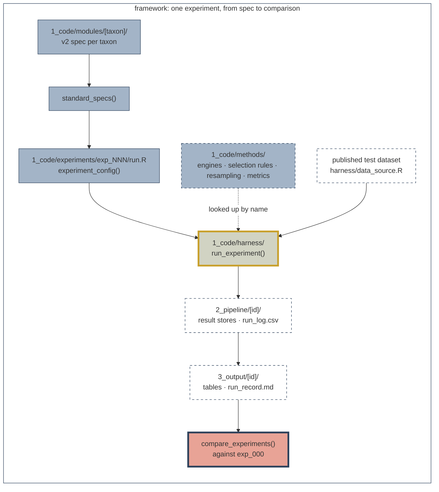

# Getting started with sdmMethodsDev

Starting guide to the `sdmMethodsDev` R&D repository.


- [What this repository is for](#what-this-repository-is-for)
- [Setup](#setup)
- [How the pipeline fits together](#how-the-pipeline-fits-together)
- [Run the baseline (exp_000)](#run-the-baseline-exp_000)
- [Test a change](#test-a-change)
- [Add or update a taxon module](#add-or-update-a-taxon-module)
- [Check that nothing broke](#check-that-nothing-broke)
- [Working conventions](#working-conventions)
- [Where to get help](#where-to-get-help)

## What this repository is for

`sdmMethodsDev` is the Science Centre's shared R&D repository for
Species Models 3.0. It generates and calls a frozen cross-taxa test dataset from `ABMI-DATA2\science\`, one
pipeline that runs every taxon's v2.0 model as configuration, and
a v2 parity check (`exp_000_parity_v2`) that every later
experiment is compared against. A methods question can be asked and answered for every taxon.

It is for testing methods. It does not produce the final species
models or reporting products.

### Words used throughout

| Word | Means |
| --- | --- |
| **Spec** | A taxon's v2 configuration as a list: response, family, regions, stages, resampling. Built by functions such as `lichen_spec()` in `1_code/modules/<taxon>/spec.R`. Holds no modelling code. |
| **Run** | One spec in an experiment, named as its output folder: `lichen`, `mammal_summer`. `standard_specs()` lists them. |
| **Stage** | One model fitted in order. Plants and birds fit `climate`, then `habitat` (or `landcover`). |
| **Carry** | Passing one stage's prediction into the next as a covariate called `Climate`. This is how v2 combines its climate and habitat models. |
| **Candidate set** | The formulas a stage chooses among. The v2 sets are in `1_code/harness/model_sets.R`. |
| **Method** | A named, registered piece: an engine (`glm`, `bayesglm`, `xgboost`), a selection rule (`aic_average`, `staged_bic`, `ivw_grid`), a resampling scheme, or a metric. |
| **Draw** | One bootstrap resample of the survey units. v2 uses 100. Draw 1 is the full data. |
| **Store** | The results for one run and region: `coefficients.csv`, `metrics.csv`, `grid_predictions.csv`, `meta.json`. |
| **Grid** | A prediction matrix with one row per habitat type, each row a pure stand of that type. Predicting onto it lets methods be compared. |
| **Out-of-bag (oob)** | Scored on the survey units a draw left out. `insample` scores the units the draw fitted. |
| **Parity** | Whether a run reproduces v2. Distributional, not numerical: v2 sets no seed, so two v2 runs differ. |

## Setup

### Prerequisites

You need R 4.4 or later. Open the repository in VS Code, RStudio or
Positron so the working directory is the repository root. Every
path in this guide, and every script, assumes that.


### Getting the data

You do not build the data. `0_data/` is gitignored, and runs do
not read it. Runs read two published, versioned datasets from the
ABMI network share:

- **Test dataset:**
  `//ABMI-DATA2/science/sdmMethodsDev/0_data/test_dataset/<version>/`
- **v2 results** (the parity reference):
  `//ABMI-DATA2/science/sdmMethodsDev/0_data/v2_results/<version>/`

The version read is pinned in `sdm_published$versions` in
[`1_code/harness/data_source.R`][data-source]. A published version
is never overwritten. Each folder carries a `checksums.csv`, and
the test dataset's file index is `lookup/dataset_manifest.csv`.
The harness reads file locations only from that manifest.

So the one requirement is **read access to the share**, on the
ABMI network or VPN.0000

Off the network, copy the two published folders to your machine
and point the harness at them. The variables can also go in your
user `.Renviron`:

```r
Sys.setenv(
  SDM_TEST_DATASET = "D:/data/sdmMethodsDev/test_dataset/2026-10-05",
  SDM_V2_RESULTS = "D:/data/sdmMethodsDev/v2_results/2026-10-05"
)
```

`1_code/_setup/` builds and publishes these datasets. Only
maintainers run it; see the [`_setup` README][setup] if that is
you.

### Check that the setup works

First, load the framework. This sources the harness, every
method, every taxon module, and the shared species sets. It reads
no data.

```r
source("1_code/harness/harness.R")
load_framework()
```

Then confirm the data can be reached. `test_dataset_dir()` and
`v2_results_dir()` stop with a clear message if the share is
unreachable or a file is missing or the wrong size.

```r
data_dir <- test_dataset_dir()
v2_dir <- v2_results_dir()

file.exists(c(
  file.path(data_dir, "lookup", "dataset_manifest.csv"),
  file.path(v2_dir, "abmiexplorer", "v2_results.csv")
))
#> [1] TRUE TRUE
```

`verify_published(test_dataset_dir())` does a full md5 check. It
is slow over the network (about 0.9 GB), so use it only when a
copy is in doubt.

## How the pipeline fits together

The v2.0 pipelines share one sequence: choose response, fit
candidate models, choose among or average them, then predict and
score. What differs between taxa is the contents of each step.
Here, those contents are data in a **spec**, and one **harness**
runs any spec.



The runs the standard specs offer, and the methods registered:

```r
names(standard_specs())
#> [1] "bryophyte"      "lichen"         "mite"           "vascular_plant"
#> [5] "mammal_summer"  "mammal_winter"  "bird"

list_methods()  # kind, name, requires, description
```

`run_experiment()` does seven things in order:

1. **Configure.** `experiment_config()` checks every decision
   before anything is fitted.
2. **Fit.** Each spec is validated, and each species is one job.
   With `workers` above 1, jobs run in parallel R sessions. Each
   species draws under its own seed, so results do not depend on
   the worker count. A failed species or draw is logged and the
   run continues.
3. **Store.** One store per run and region in `2_pipeline/<id>/`,
   plus `run_log.csv`.
4. **Summarize.** `collect_results()` writes
   `3_output/<id>/tables/`.
5. **Compare.** Every experiment except exp_000 writes
   `tables/comparison_metrics.csv` against exp_000.
6. **Steps.** The experiment's own `steps`, in order.
7. **Record.** `run_record.md`.

The full argument list and output file definitions are in the
[harness README][harness].

### Where things are

| Folder | Holds | Edit it to |
| --- | --- | --- |
| `1_code/harness/` | The shared pipeline: configure, fit, store, summarize, compare. Names no taxon and no method | Change how every experiment runs (review as such) |
| `1_code/methods/` | Engines, selection rules, resampling schemes, metrics; each file registers one method | Add a method |
| `1_code/modules/<taxon>/` | Each taxon's v2 spec; `_shared/` holds the plant-group builder and `standard_specs()` | Record what v2 does for a taxon |
| `1_code/experiments/exp_NNN_*/` | One folder per question; `run.R` holds the decisions | Ask a question |
| `1_code/experiments/_shared/` | Named focal-species sets | Add a reusable species set |
| `1_code/tests/` | Contract tests and the store comparison | Add a check |
| `1_code/_setup/` | One-off scripts that build and publish the dataset | Rebuild or extend the dataset (maintainers) |
| `0_data/test_dataset/` | The dataset as `_setup/` builds it; runs read the published copy | Nothing; rebuilt by `_setup/` |
| `2_pipeline/<id>/` | Result stores and intermediates; gitignored | Nothing; written by runs |
| `3_output/<id>/` | Summary tables, figures, report, run record | Nothing by hand; small summaries are committed |
| `docs/` | This guide, design, taxon quirks, reviews | |

## Run the baseline (exp_000)

`exp_000_parity_v2` runs each taxon's v2 spec and compares the
result with the published v2 coefficients. It is the baseline for
every other experiment. It is intended as the gate before
iterative R&D (i.e. results should be in parity with v2 results)

> [!IMPORTANT]
> The baseline run has already been done and the results .git tracked. It does not need to be redone for each experiment. The below steps are intended for future repo maintainers an those who want to understand how `exp_000_parity_v2` works. 
>

### Step 1: Check the settings

Open [`1_code/experiments/exp_000_parity_v2/run.R`][exp000-run].
Section 1.2, the `experiment_config()` call, is the whole
configuration. Check three settings:

| Setting | Quick check | Full run |
| --- | --- | --- |
| `species` | `"one_each"` (one species per taxon) or `"parity_check"` (two per taxon; the committed value) | `NULL`, every species |
| `n_bootstraps` | `5` (the committed value) | `100` |
| `workers` | 4 | Up to the cores you can spare (committed: 12) |

The named species sets are:

```r
names(focal_species_sets())
#> [1] "full"         "parity_check" "plants_only"  "one_each"
```

Shorten a trial by cutting species, not draws. A 10-90% band read
from five draws is unstable. On a 24-core machine, the 14
`parity_check` species at 5 draws took about 6 minutes on one
worker and about 1.6 minutes on 12. A full run of every species
at 100 draws is days of compute.

Parallel workers load the framework from disk when the run
starts, so do not edit files in `1_code/` while one is starting.

### Step 2: Run it

```r
source("1_code/experiments/exp_000_parity_v2/run.R")
```

`experiment_config()` prints what it will do, and notes if you are
running fewer than 100 draws. After fitting, `run_experiment()`
runs exp_000's three steps: `01_compare_to_v2.R`,
`02_plot_parity.R`, and `03_build_report.R`.

To rebuild the tables, figures, and report from existing stores
without refitting, set `fit = FALSE` in the `run_experiment()` call
in section 2 of `run.R`.

### Step 3: Find the outputs

| Where | What |
| --- | --- |
| `2_pipeline/exp_000_parity_v2/<run>/<region>/` | Result stores: `coefficients.csv`, `metrics.csv`, `grid_predictions.csv`, `meta.json` |
| `2_pipeline/exp_000_parity_v2/run_log.csv` | Every species, region, and draw: `ok`, or why not |
| `3_output/exp_000_parity_v2/run_record.md` | What ran: species, draws, seed, data versions |
| `3_output/exp_000_parity_v2/report.md` | What each spec reproduces of v2, parity by stage, and model fit |
| `3_output/exp_000_parity_v2/tables/parity_summary.csv` | The gate table: one row per taxon, region, and stage |
| `3_output/exp_000_parity_v2/tables/parity_terms.csv` | Term-by-term comparison (gitignored) |
| `3_output/exp_000_parity_v2/tables/metric_summary.csv` | Fit metrics per species; read the `oob_` rows |
| `3_output/exp_000_parity_v2/tables/grid_summary.csv` | Predicted effect of each habitat type, per species |
| `3_output/exp_000_parity_v2/figures/` | Parity plots per taxon |

Read `run_record.md` first. If it does not say every species at
100 draws, the numbers describe a trial.

### Step 4: Tell whether parity passed

Open `tables/parity_summary.csv`:

```r
library(data.table)

parity <- fread(
  "3_output/exp_000_parity_v2/tables/parity_summary.csv"
)
parity[, .(
  taxon, region, stage, comparison, min_draws,
  reachable_in_band_pct, verdict, indicative_verdict
)]
```

Read the `verdict` and `indicative_verdict` columns:

| Value | Means |
| --- | --- |
| `pass` / `fail` | Against the targets in `utils/parity_targets.R` |
| `not gated (trial run)` | Fewer draws than v2, or a species subset; no verdict given |
| `not gated (store holds N draws)` | The store holds fewer draws than v2 |
| `no comparison` | No reachable terms to compare |

Only a full run (`species = NULL`, `n_bootstraps = 100`) fills
`verdict`. A 100-draw run on a species subset fills
`indicative_verdict` instead. The proposed targets:

- **Distributional** (plant and bird stages): at least 90% of
  reachable terms with the v2 median inside the run's 10-90% band,
  median standardized difference at most 0.25, and median
  band-width ratio between 0.75 and 1.33.
- **Numerical** (mammals, fitted once by v2): every reachable term
  within 1e-6 on iteration 1.

Commit `run_record.md`, `report.md`, and the summary tables only
after a full run. `.gitignore` already limits what can be
committed from `3_output/`.

## Test a change

An experiment asks one question by changing one thing relative to
exp_000. Everything else (taxa, species, draws, seed) stays the
same unless it is the question.

For a step-by-step build of a real experiment, from scaffolding to
write-up, see the worked examples:
[new covariates](example_experiment.md) (`exp_002_soilgrids`) and [a different method](example_experiment_xgboost.md)
(`exp_001_xgboost`).

### Scaffold an experiment

`new_experiment()` is base R and runs without `load_framework()`.
Preview first; a dry run writes nothing:

```r
source("1_code/harness/new_experiment.R")
new_experiment("covariate scale", dry_run = TRUE)
#> exp_003_covariate_scale (dry run; nothing written)
#>   ./1_code/experiments/exp_003_covariate_scale
#>   ./2_pipeline/exp_003_covariate_scale
#>   ./3_output/exp_003_covariate_scale
```

Then create it:

```r
new_experiment("covariate scale")
```

It takes the next free number across `1_code/experiments/`,
`2_pipeline/`, and `3_output/`, and creates:

- `1_code/experiments/<id>/`: `run.R` and `README.md` from
  `_template/`, with id, title, author, and date filled in.
- `2_pipeline/<id>/logs/`: for intermediates (gitignored).
- `3_output/<id>/`: `figures/`, `tables/`, and a stub `report.md`.

Leave `id` in `run.R` as it is. Write the question and design in
the experiment's `README.md` before you run anything.

`run.R` loads the framework, calls `experiment_config()`, then
`run_experiment()`.

### 1. Different candidate formulas: `stage_models`

The covariates a run loads are read off its formulas, so this is
also how you try new covariates.

```r
config <- experiment_config(
  id = "exp_003_covariate_scale",
  taxa = c("bryophyte", "lichen", "mite", "vascular_plant"),
  species = "parity_check",
  n_bootstraps = 5,
  stage_models = list(
    # every v2 plant climate candidate, plus elevation
    climate = extend_models("climate_plant_v2_full", "elevation"),
    # mites only: a ladder built from three covariates
    mite.climate = models_from_covariates(
      c("MAP", "FFP", "CMD"),
      form = "ladder"
    )
  ),
  workers = 4
)
```

A covariate the dataset does not hold comes from the experiment.
Write a script in the experiment's folder that saves a CSV to
`2_pipeline/<id>/inputs/`, one row per `survey_unit_id`, and name
it in `covariate_files`. Never add to `0_data/` or change
`_setup/`: those hold the v2 data every experiment is compared
against. [`exp_002_soilgrids`][exp002] is the worked example.

### 2. A different engine or rule: `specs`

Build the standard specs, change a stage, and pass them in.
`replace_stage_method()` swaps each spec's habitat stage, and
drops v2 post-processing that needs coefficients:

```r
specs <- lapply(
  standard_specs(), replace_stage_method,
  engine = "xgboost"
)

config <- experiment_config(
  id = "exp_003_covariate_scale",
  specs = specs,
  species = "parity_check",
  n_bootstraps = 5
)
```

To change one stage by hand instead, edit the spec list directly,
for example `specs$bird$stages[[2]]$selection <- "single"`.

`validate_spec()` checks the combination before anything runs. A
rule that needs what the engine cannot give, such as standard
errors for inverse-variance averaging, stops the run with a
sentence that says so. [`exp_001_xgboost`][exp001] is the worked
example.

### 3. A new method

Copy the matching template from `1_code/methods/_templates/` into
the right folder of `1_code/methods/`, fill it in, and register
it. Check an engine with `check_engine()`, confirm it appears in
`list_methods()`, then name it in a spec:

```r
check_engine("glm")    # or check_engine(engine_mine())
list_methods("engine")
```

The engine, selection, resampler, and metrics, and a
checklist, are in the [methods README][methods].

### Run it and read the comparison

Run it at 5 draws to check it works, then at 100. Compare it with
an exp_000 run at the same number of draws.

```r
source("1_code/experiments/exp_003_covariate_scale/run.R")
```

Outputs go to `2_pipeline/<id>/` and `3_output/<id>/`, laid out as
for exp_000. `run_experiment()` prints a headline per taxon,
region, and metric (the median difference from exp_000, and the
share of species that did better). It writes
`tables/comparison_metrics.csv`: one row per species and metric,
with both runs' 10-90% bands. Set `baseline = NULL` in
`experiment_config()` to skip the comparison.

"Better" means higher AUC, deviance explained, and Spearman; lower
RMSE; and a calibration slope closer to 1. A difference is worth
reading only if it is consistent across species and large relative
to the bands.

## Add or update a taxon module

A module is configuration, not modelling code. It states what v2
does for a taxon as a spec list, and the harness runs it.

### The interface

From the [modules README][modules] and `1_code/harness/spec.R`, a
module must:

1. Define `<taxon>_spec(...)` in
   `1_code/modules/<taxon_plural>/spec.R`, returning a spec list.
2. Return a spec that passes `validate_spec()`. Unknown fields are
   errors, and every engine, rule, and resampler it names must be
   registered.
3. Add its run to `standard_specs()` in
   `1_code/modules/_shared/standard_specs.R`.

`load_framework()` sources `_shared/` first, then every other
module folder, each in file-name order. The fields a spec may use
are defined by `spec_fields()`, one vector per level:

```r
names(spec_fields())
#> [1] "spec"     "region"   "stage"    "resample"

spec_fields()$stage
#>  [1] "name"               "models"             "engine"
#>  [4] "selection"          "ic"                 "control"
#>  [7] "family"             "scope"              "weighted"
#> [10] "base_terms"         "response_transform" "row_filter"
#> [13] "min_detections"     "extra_covariates"   "post_process"
#> [16] "calibrate"          "carry_as"           "carry_scale"
#> [19] "carry_offset"       "carry_from"         "carry_from_as"
#> [22] "constants"          "grid_constants"
```

A stage may also hold any argument its selection rule takes, as a
setting for that rule (for example `always_advance` for
`staged_bic`). Check an existing spec, and what it reproduces:

```r
validate_spec(lichen_spec())
spec_coverage(list(bird = bird_spec()))
```

### A minimal skeleton

Modelled on `bird_spec()`. Replace every `<...>`. The model set
names must exist in `model_sets()` (`1_code/harness/model_sets.R`),
and the grid name must exist in the dataset manifest.

```r
#' Build the v2 Spec for <Taxon>
#'
#' @return A spec list, as run_spec() consumes.
#'
#' @example # Example usage of the function
#' # validate_spec(<taxon>_spec())
<taxon>_spec <- function() {
  list(
    taxon = "<data_slug>",
    habitat_stage = "habitat",
    response_name = "response",
    response_transform = "identity",
    family = "binomial",
    weight_column = NULL,

    # One-sided formulas on the site columns, as in bird_spec()
    regions = list(
      north = list(
        filter = ~ useNorth == 1,
        grid = "<grid_name>",
        habitat_models = "<habitat_model_set_north>"
      ),
      south = list(
        filter = ~ useSouth == 1,
        grid = "<grid_name>",
        habitat_models = "<habitat_model_set_south>"
      )
    ),

    stages = list(
      list(
        name = "climate",
        models = "<climate_model_set>",
        engine = "glm",
        selection = "aic_average",
        ic = "AICc",
        carry_as = "Climate"
      ),
      list(
        name = "habitat",
        models = NULL, # per region: habitat_models
        engine = "glm",
        selection = "aic_best",
        ic = "AICc",
        carry_from = "climate",
        carry_from_as = "Climate"
      )
    ),

    resample = list(scheme = "spatial_block"),

    v2_coverage = list(
      climate = v2_status("partial", "<what is reproduced>"),
      habitat = v2_status("partial", "<what is reproduced>")
    ),

    notes = "<configuration facts>"
  )
}
```

Then add it to `standard_specs()`:

```r
# in 1_code/modules/_shared/standard_specs.R
standard_specs <- function(plant_bootstrap = "spatial_block") {
  list(
    # ... existing runs ...
    <taxon> = <taxon>_spec()
  )
}
```

A new taxon also needs data. The full sequence is in the
[modules README][modules-add]: v2 scripts into
`0_data/v2_scripts/`, `_setup/01`, `02`, `07`, and `06` extended,
candidate formulas spliced into `model_sets.R`, and each
taxon-specific behaviour recorded in
[`docs/taxon_quirks.md`][quirks]. Those `_setup/` steps are
maintainer work.

## Check that nothing broke

A change to `harness/`, `methods/`, or `modules/` affects every
experiment, past and future. Before relying on it, take two steps.

**1. Run the tests.** These take seconds:

```sh
Rscript 1_code/tests/run_tests.R
```

**2. Confirm the v2 results are unchanged.** Draws are seeded per
species and made in order, so draws 1-5 of a 5-draw run match
draws 1-5 of a 100-draw run. Run the `parity_check` species at 5
draws to a scratch folder (set `pipeline_dir` and `out_dir` in
`experiment_config()`), then compare:

```sh
Rscript 1_code/tests/compare_stores.R \
  2_pipeline/exp_000_parity_v2 2_pipeline/<scratch> 5
```

Every coefficient file should match to 1e-10. More on both
tools is in the [tests README][tests].

## Working conventions

- **Naming:** `snake_case` everywhere. Experiments are
  `exp_NNN_short_description`, the same in `1_code/experiments/`,
  `2_pipeline/`, and `3_output/`. Sequenced scripts take an `NN_`
  prefix; entry points are `run.R`. Module folders use the plural
  taxon name (`soil_mites/`); specs use the data slug (`mite`).
  See the [root README conventions][readme-conv] and
  [code_standards: project structure][cs-structure].
- **Scripts and style:** every script has the standard header and
  numbered `----` sections; tidyverse style, `%>%`, lines of 70
  characters or fewer. See [code_standards: templates][cs-templates]
  and [code style][cs-style].
- **Code review:** review against the five areas in
  [code_standards: code review][cs-review]. Treat any change to
  `harness/`, `methods/`, or `modules/` as a change to every
  experiment: include passing tests and a `compare_stores.R`
  result.
- **Commits from `3_output/`:** commit only runs that count, every
  species at 100 draws, and check `run_record.md` says so.

## Where to get help

- **Repository and data access:** Brendan Casey,
  brendan.casey@ualberta.ca 

- **Design and contracts:** [`docs/framework_design.md`][design].
- **Every taxon-specific v2 behaviour:**
  [`docs/taxon_quirks.md`][quirks].
- **Folder detail:** the READMEs in [`harness/`][harness],
  [`methods/`][methods], [`modules/`][modules],
  [`experiments/`][experiments], [`tests/`][tests], and
  [`_setup/`][setup].
- **Related tools:**
  [sciCentRverse](https://github.com/ABbiodiversity/sciCentRverse)
  and [sciSpatialR](https://github.com/ABbiodiversity/sciSpatialR).

<!-- Absolute links, so they work in the repository and on the
     docs site alike -->

[readme]: https://github.com/ABbiodiversity/sdmMethodsDev/blob/main/README.md
[readme-prereq]: https://github.com/ABbiodiversity/sdmMethodsDev/blob/main/README.md#prerequisites
[readme-conv]: https://github.com/ABbiodiversity/sdmMethodsDev/blob/main/README.md#conventions
[readme-contact]: https://github.com/ABbiodiversity/sdmMethodsDev/blob/main/README.md#contact
[data-source]: https://github.com/ABbiodiversity/sdmMethodsDev/blob/main/1_code/harness/data_source.R
[harness]: https://github.com/ABbiodiversity/sdmMethodsDev/blob/main/1_code/harness/README.md
[methods]: https://github.com/ABbiodiversity/sdmMethodsDev/blob/main/1_code/methods/README.md
[modules]: https://github.com/ABbiodiversity/sdmMethodsDev/blob/main/1_code/modules/README.md
[modules-add]: https://github.com/ABbiodiversity/sdmMethodsDev/blob/main/1_code/modules/README.md#adding-a-taxon-module
[experiments]: https://github.com/ABbiodiversity/sdmMethodsDev/blob/main/1_code/experiments/README.md
[exp000]: https://github.com/ABbiodiversity/sdmMethodsDev/blob/main/1_code/experiments/exp_000_parity_v2/README.md
[exp000-run]: https://github.com/ABbiodiversity/sdmMethodsDev/blob/main/1_code/experiments/exp_000_parity_v2/run.R
[exp001]: https://github.com/ABbiodiversity/sdmMethodsDev/blob/main/1_code/experiments/exp_001_xgboost/README.md
[exp002]: https://github.com/ABbiodiversity/sdmMethodsDev/blob/main/1_code/experiments/exp_002_soilgrids/README.md
[tests]: https://github.com/ABbiodiversity/sdmMethodsDev/blob/main/1_code/tests/README.md
[setup]: https://github.com/ABbiodiversity/sdmMethodsDev/blob/main/1_code/_setup/README.md
[design]: https://github.com/ABbiodiversity/sdmMethodsDev/blob/main/docs/framework_design.md
[quirks]: https://github.com/ABbiodiversity/sdmMethodsDev/blob/main/docs/taxon_quirks.md
[cs-structure]: https://github.com/bgcasey/code_standards#6-project-directory-structure
[cs-templates]: https://github.com/bgcasey/code_standards#1-script-templates
[cs-style]: https://github.com/bgcasey/code_standards#2-code-style
[cs-review]: https://github.com/bgcasey/code_standards#7-code-review
